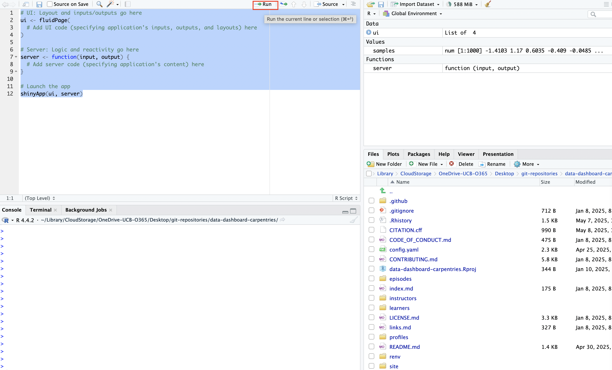
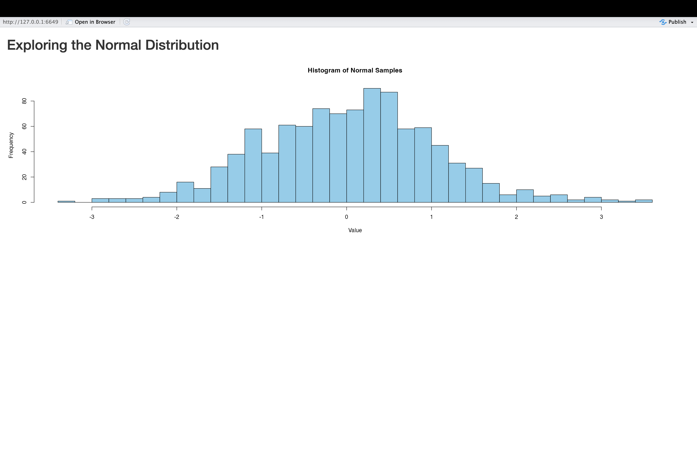

:::::::::::::::::::::::::::::::::::::: questions 

- What are the different components of a Shiny application and how do they fit together?
- How can we create, run, and view a simple Shiny application? 
- How can we create an interactive Shiny application that is responsive to user inputs or requests? 
- How can we customize the appearance of a simple Shiny application? 

::::::::::::::::::::::::::::::::::::::::::::::::

::::::::::::::::::::::::::::::::::::: objectives

- Explain how to use markdown with the new lesson template
- Demonstrate how to include pieces of code, figures, and nested challenge blocks

::::::::::::::::::::::::::::::::::::::::::::::::

## Preliminaries

Before beginning this episode, please load the following libraries"


``` r
# load libraries
library(shiny)
```


## The Structure of a Shiny Application

At the conclusion of the previous Episode, we examined some currently published Shiny applications. Now, we'll begin peeking "under the hood" to see how these applications are put together, and how they work. Our starting point is the observation that all Shiny applications, no matter how complex, have three fundamental and interrelated building blocks:

* A **user interface (UI)** that specifies the appearance and layout of the application
* A **server** that defines how an application generates outputs in response to user inputs
* A call to the ```shinyApp()``` function, which launches the application by bringing together the **UI** and **server**

The relationship between the user interface and server is dynamic and bi-directional; the server provides substantive content (created using R code) that populates the user interface, while the user interface defines how that content is organized and displayed to users. This may sound fairly abstract, but will hopefully come into focus as we proceed. 

## Our first application: Hello, World! 

In this section, we'll develop our very first Shiny application. There's a good chance that the first (or one of the first) things you did in R was to print a "Hello, World" statement:


``` r
# prints "Hello, World"
print("Hello, World")
```

``` output
[1] "Hello, World"
```

Our goal in this section is to wrap this statement into a "Hello, World" Shiny application. 

### A note on application files and directories

First, though, it is important to briefly discuss where to write and store your applications. Ideally, you should create a separate dedicated directory for each application you write. For now, we'll create our application scripts, containing the UI and server code, in a familiar **.R** file (but R Studio does have a handy pre-built template for Shiny applications, which we'll introduce later on). This application directory can also contain other elements relevant to or referenced by your application (such as image files, datasets, Readme files etc.). As applications grow in complexity, it could make sense for you to use subdirectories to organize your main application directory. 

Each R script should only contain the code for a single application; trying to include the code for multiple applications in a single script can cause errors or undefined behavior when you try to launch an application (since Shiny may be confused about which application it's supposed to run). That said, in this episode, we'll be creating and running several simple "toy" applications to illustrate important Shiny features. You can either save each application in separate scripts, or write all of the applications in a single script while commenting out the code for the application(s) you are NOT running; that way, you can write code for several simple applications in one **.R** file, while ensuring that only one script at a time is "live" when you try to launch it. 

### Writing the "Hello, World" application

Let's first write out our application's skeletal structure, translating the three components we discussed above (the UI, server, and ```shinyApp()```) into actual Shiny code. After getting this structure down, we'll fill in elements to create the "Hello, World" application below. Recall from above that the application's UI defines how the application *looks* (i.e. what are the inputs and outputs, and how are they visually displayed), the server defines what the application *does* and how it works (i.e. how inputs are processed to generate outputs), and the call to ```shinyApp()``` brings these elements together to launch the application. 


``` r
# UI: Layout and inputs/outputs go here
ui <- fluidPage(
  # Add UI code (specifying application's inputs, outputs, and layouts) here
)

# Server: Logic and reactivity go here
server <- function(input, output) {
  # Add server code (specifying application's content) here
}

# Launch the app 
shinyApp(ui, server)
```

Some aspects of this code require additional clarification.

* The ```fluidPage()``` function used in the creation of the UI object is a Shiny layout function that creates a responsive web page layout that automatically adjusts to different screen sizes. The arguments to ```fluidPage()```, will contain additional functions that define the user interface. 
* Within the server function, "input" is used to access values the user has entered or selected in the UI, while "output" is used to define the content that is displayed within the UI. Sometimes, in more complex applications with more sophisticated user interfaces, you will also see a "session" argument in the server function, but that is beyond the scope of our current workshop. 

Again, this may still seem a little but abstract, but will hopefully come into focus as we proceed. You can launch an application from your script by simply running the UI and server code, along with with ```shinyApp(ui, server)```:

<div class="figure" style="text-align: center">

<p class="caption">Figure 2. Launching an App</p>
</div>

Since our application is still empty, launching it will generate a blank page that looks something like this:

<div class="figure" style="text-align: center">

<p class="caption">Figure 3. A Blank Application</p>
</div>

Now, let's go ahead and create our "Hello, World" app by adding this text to the application structure we've defined above. It may not seem intuitive at first, but we'll unpack it after writing out the code and launching the application. 


``` r
# UI: Layout and inputs/outputs go here
ui <- fluidPage(
  textOutput(outputId="greeting")  # Placeholder for text
)

# Server: Logic and reactivity go here
server <- function(input, output) {
  # Add server code (specifying application's text)
  output$greeting <- renderText({
    "Hello, World!"  # application content
  })
}

# Launch the app
shinyApp(ui, server)
```

When you go ahead and launch this application from your .R file, you'll see something that looks like this:

<div class="figure" style="text-align: center">

<p class="caption">Figure 4. The 'Hello, World!' Application</p>
</div>

Congratulations on writing your first Shiny application!

This application was simple--it's just a blank web page with "Hello, World!" written on it--but it's certainly less intuitive than printing that string to the console with ```Hello, World```. The code above needs some unpacking:

* ```textOutput()``` is one of Shiny's UI output functions; it creates a placeholder in the user interface for a text string that will be defined in the server. The argument to this function, "greeting", is an arbitrary identifier that will be used to link the text string defined in the server back to this placeholder in the user interface. To learn more about ```textOutput()``` please consult the documentation with ```?textOutput()```. 
* After creating the placeholder for text output in the UI, the server defines what text will be displayed in the UI  with ```output$greeting <- renderText({"Hello, World!"})```. ```renderText()``` is a server-side output function used to generate the text displayed in the placeholder created by ```textOutput()```. In Shiny, ```output()``` is a special object that is used to store content that will be displayed in the UI. Shiny uses dollar sign notation to assign the content in the output object to a specific UI placeholder, identified by its output ID. Here, ```output$greeting``` connects the rendered text to the UI placeholder identified by ```outputId="greeting"```. 

::::::::::::::::::::::::::::::::::::: callout

In Shiny, output functions determine what gets displayed in the application. These are used to show text, plots, tables, or other content, either by reserving space in the UI (UI output functions) or by generating content in the server (server-side output functions). 

* Output functions in the UI are sometimes referred to as "placeholder functions" because they reserve space in the UI where content created in the server will appear. 

* Output functions in the server are sometimes referred to as "render functions", because they generate (or "render") the content that fills the placeholders defined in the UI. 

Each render function in the server has a matching placeholder in the UI. For example, in the simple "Hello, World!" app, the placeholder function ```textOutput()``` reserves space in the UI, while the corresponding render function ```renderText()``` generates the text that will be shown there. 

Shiny connects the two using ```output$id``` where "id" matches the identifier given to the placeholder.The content returned by the render function is displayed in the UI at the location specified by the placeholder. 

::::::::::::::::::::::::::::::::::::::::::::::::

::::::::::::::::::::::::::::::::::::: challenge 

## Challenge 1: Make your own text app

Using what you've learned above, make your own basic Shiny application that communicates a message in simple text. Rather than simply modifying the "Hello, World!" app, write it from scratch; this will help you become familiar with Shiny's syntax. 
:::::::::::::::::::::::::::::::::::::

## Displaying a plot in a Shiny application

Instead of printing a text string in our application, let's instead create a Shiny application that displays a simple plot that's generated with some R code. Below, we generate 1000 random values from a normal distribution with a mean of 0 and a standard deviation of 1, and assign the resulting vector to a new object named ```samples```. We then plot a histogram of the ```samples``` data that's divided into 30 bins:


``` r
# create a vector of 1000 randomly generated values from a normal distribution with a mean of 0 and SD of 1
samples <- rnorm(1000, mean = 0, sd = 1)

# make a histogram of "samples" data
hist(samples, breaks = 30, col = "skyblue",
     main = "Histogram of Normal Samples",
     xlab = "Value")
```


Let's wrap this histogram into a simple Shiny app; we'll do so in much the same way we wrapped "Hello, World" into a Shiny app, with some minor adjustments to account for the fact that we want to display a plot, rather than text. In particular, we'll use a new set of output functions designed specifically for plots (rather than output functions designed for text, as above). Let's start by first creating the skeletal structure for a blank application:


``` r
# UI: Layout and inputs/outputs go here
ui <- fluidPage(
  # Add UI code (specifying application's inputs, outputs, and layouts) here
)

# Server: Logic and reactivity go here
server <- function(input, output) {
  # Add server code (specifying application's content) here
}

# Launch the app 
shinyApp(ui, server)
```

Now, let's begin populating the application:

* In the "Hello, World!" application, we didn't make a title for the application. That can be a useful thing to do, so here, we'll create a title for the application using Shiny's ```titlePanel()``` function. We'll name the application "Exploring the Normal Distribution", which we can pass as an argument to ```titlePanel()``` in the UI. 
* We'll create a placeholder for the plot in the UI using Shiny's ```plotOutput()``` function, and use "normal_plot" as the output ID. Note that different elements in the UI are separated by a comma (in this case, a comma separates the ```titlePanel()``` and ```plotOutput()``` functions) 
* Then, in the server, we'll wrap the code to make our plot within the ```renderPlot()``` function, and assign this output back to the UI using the "normal_plot" ID.  

Our application code should look something like this:


``` r
# UI: Layout and inputs/outputs go here
ui <- fluidPage(
  # Add UI code (specifying application's inputs, outputs, and layouts) here
  titlePanel("Exploring the Normal Distribution"),
  plotOutput(outputId = "normal_plot")
)

# Server: Logic and reactivity go here
server <- function(input, output) {
  # Add server code (specifying application's content) here
  output$normal_plot<-renderPlot({
    # create vector
    samples <- rnorm(1000, mean = 0, sd = 1)
    
    # make a histogram of "samples" data
    hist(samples, breaks = 30, col = "skyblue",
         main = "Histogram of Normal Samples",
         xlab = "Value")
  })
}

# Launch the app 
shinyApp(ui, server)
```

When you're ready, go ahead and launch the application. It will look something like this:

<div class="figure" style="text-align: center">

<p class="caption">Figure 5. The Normal Plot Application</p>
</div>

## Applications with multiple outputs 

The "Hello, World!" application displayed a text output, while the app we just created displayed a plot output. There's no reason why a Shiny application cannot include many different types of outputs (indeed, most "real world" Shiny apps do!). Let's now make a slightly more complex application that incorporates both text and plot outputs; we'll use the same plot as above, and add some text to provide some additional context, using ```textOutput()``` to create a placeholder in the UI, and the ```renderText()``` function to create the message we'd like to display. The output created using ```renderText()``` is assigned back to the UI placeholder by using dollar sign notation to reference the output ID specified in ```textOutput()```. Your application code should look something like the following:


``` r
# UI: Layout and inputs/outputs go here
ui <- fluidPage(
  # Add UI code (specifying application's inputs, outputs, and layouts) here
  titlePanel("Exploring the Normal Distribution"),
  textOutput(outputId="context_discussion"),
  plotOutput(outputId = "normal_plot")
)

# Server: Logic and reactivity go here
server <- function(input, output) {
  # Add server code (specifying application's content) here
  
  # creates text output
  output$context_discussion<-renderText({
    "This histogram shows 1,000 values randomly drawn from a standard normal distribution. Most values fall between -3 and 3, with a peak around 0."
  })
  
  # creates plot output
  output$normal_plot<-renderPlot({
    # create vector
    samples <- rnorm(1000, mean = 0, sd = 1)
    
    # make a histogram of "samples" data
    hist(samples, breaks = 30, col = "skyblue",
         main = "Histogram of Normal Samples",
         xlab = "Value")
  })
}

# Launch the app 
shinyApp(ui, server)
```

Now, let's go ahead and launch our application, and see what it looks like:

<div class="figure" style="text-align: center">

<p class="caption">Figure 6. The Normal Plot Application With Text</p>
</div>

Note the text above the plot in this modified application.

::::::::::::::::::::::::::::::::::::: challenge

## Challenge 2: Change an application's layout

In the application we just created, the written text providing relevant context is situated above the plot. Modify the application code so that it's instead below the plot. 

::: solution

To make this change, you can simply move ``` textOutput()``` function below the ```plotOutput()``` function in the UI. There is no need to change the order of anything in the server; the order in which elements is displayed is solely governed by the UI code. The code for a modified application with the text element below the plot looks as follows:


``` r
# UI: Layout and inputs/outputs go here
ui <- fluidPage(
  # Add UI code (specifying application's inputs, outputs, and layouts) here
  titlePanel("Exploring the Normal Distribution"),
  plotOutput(outputId = "normal_plot"),
  textOutput(outputId="context_discussion")
)

# Server: Logic and reactivity go here
server <- function(input, output) {
  # Add server code (specifying application's content) here
  
  # creates text output
  output$context_discussion<-renderText({
    "This histogram shows 1,000 values randomly drawn from a standard normal distribution. Most values fall between -3 and 3, with a peak around 0."
  })
  
  # creates plot output
  output$normal_plot<-renderPlot({
    # create vector
    samples <- rnorm(1000, mean = 0, sd = 1)
    
    # make a histogram of "samples" data
    hist(samples, breaks = 30, col = "skyblue",
         main = "Histogram of Normal Samples",
         xlab = "Value")
  })
}

# Launch the app 
shinyApp(ui, server)
```

:::

:::::::::::::::::::::::::::::::::::::

## A conceptual overview of interactive applications

So far, we have learned about the basic structure of Shiny applications and how to populate them with content by linking output functions in the UI (placeholder functions) with output functions in the server (render functions). You may have noticed that the applications we have built so far are static, in the sense that they don't respond dynamically to user input. However, static applications have limited utility, and much of the power and usefulness of Shiny applications comes from their ability to dynamically respond to user input. 

### Input Functions

To build dynamic, interactive applications, we need to introduce a new class of Shiny functions: input functions. Input functions are UI functions that create interactive elements where users can enter or select information (such as text boxes, sliders, check boxes, or radio buttons). This user input can then determine what gets displayed in the app. 

For example, imagine an app that contains some text output in the UI, and radio buttons that let the user choose a language. If the user selects "English", the text appears in English; if they select "Spanish", it appears in Spanish. The function that creates these radio buttons in Shiny is considered an input function.

### Reactivity

In Shiny, applications respond to user input by automatically recalculating and updating outputs whenever their underlying inputs change. For example, if a user adjusts a slider input specifying a date range, any outputs depending on that slider (i.e. a plot, text, table etc.) will automatically update without needing to refresh or re-run the app. This concept is known as *reactivity*.

Reactivity is built into Shiny functions. For example, the server-side ```renderPlot()``` function can explicitly reference input values (we'll see how to do this below); the plot will automatically re-render whenever the user changes a relevant input value. In other words, render functions "listen" for changes in inputs and update their output value accordingly. 

It's worth highlighting how unique reactive behavior in Shiny is, compared to the way the R programming language works more generally. In particular, traditional R code is emphatically *not* reactive. To make this more concrete, let's consider an example. First, we'll define two new objects, ```x``` and ```y```"


``` r
# defines objects x and y
x<-5
y<-x+1
```

As expected, we can see the value of ```y``` is 6:


``` r
# prints value of y
y
```

``` output
[1] 6
```

Now, let's change the value of of ```x``` to 10:


``` r
# assigns new value of 10 to object x
x<-10
```

Now, what is the value of ```y```? As you likely know from your previous experience with R, the value of y would remain unchanged:


``` r
# prints value of y
y
```

``` output
[1] 6
```

This is the essence of *non-reactive* behavior: R does not automatically re-calculate the value of ```y``` after the change in ```x```. In order for the updated value of ```x``` to be reflected in the value of ```y```, it would be necessary to re-run ```y<-x+1```. However, in a reactive context such as Shiny, outputs automatically update whenever their dependent inputs change. For example, if ```x``` were controlled by a user input (e.g. a slider), and ```y``` was displayed in the app using ```renderText()```, then an app user updating the slider would automatically trigger a recalculation of y, without needing to re-run any code. This is the essence of reactivity in Shiny: it allows your applications to respond automatically to user input, without manual intervention or re-running code. 

## Writing interactive applications

With those concepts in mind, let's now turn to writing some simple interactive applications that use input functions and utilize Shiny's reactive capabilities. We'll start by modifying our previous "Hello, World!" application. Rather than having the application always display the same static "Hello, World!" greeting, we'll allow the user to enter their own greeting using a text box. By default, the app will display "Hello, World!", but users can replace this with a custom message-making the application dynamic and interactive (though still, of course, very simple). We can generate such an application with the following:


``` r
# UI: Layout and inputs/outputs go here
ui <- fluidPage(
  titlePanel("Greeting Application"),
  
  # Input: Text box for user to input their own message
  textInput("user_input", label = "Enter your greeting:", value = "Hello, World!"),
  
  # Output: Display the greeting
  textOutput("greeting")
)

# Server: Logic and reactivity go here
server <- function(input, output) {
  
  # Reactive output based on user input
  output$greeting <- renderText({
    paste(input$user_input)  # Dynamically update the greeting based on input
  })
}

# Launch the app 
shinyApp(ui, server)
```

Let's unpack the code above:

* We use 


make an app in which "Hello, World!" is the default text output, but which also allows the user to change this greeting by writing their preferred greeting into a text box, which is then returned by the application as an output. 


simply having  "Hello, World", we'll make an app in which "Hello, World!" is the default greeting, but allow the user to change the greeting by writing a new greeting of their choicehave app respond to user input. 

  


because ```y``` was calculated before ```x``` was changed, and R does not automatically re-calculate Y 


it's a good starting point. Before moving on, there are a few things we should note about this application:

* First, note that 


## adds plot


## Introducing Reactivity


### Creating the "Hello, World" Application


Let's begin by writing out the code for an empty Shiny application. You can write Shiny applications in a simple R


-organizing files in a directory devoted to shiny


This is a lesson created via The Carpentries Workbench. It is written in
[Pandoc-flavored Markdown][pandoc] for static files (with extension `.md`) and
[R Markdown][r-markdown] for dynamic files that can render code into output
(with extension `.Rmd`). Please refer to the [Introduction to The Carpentries
Workbench][carpentries-workbench] for full documentation.

What you need to know is that there are three sections required for a valid
Carpentries lesson template:

 1. `questions` are displayed at the beginning of the episode to prime the
    learner for the content.
 2. `objectives` are the learning objectives for an episode displayed with
    the questions.
 3. `keypoints` are displayed at the end of the episode to reinforce the
    objectives.

:::::::::::::::::::::::::::::::::::::::::::::::::::::::::::::::::::: instructor

Inline instructor notes can help inform instructors of timing challenges
associated with the lessons. They appear in the "Instructor View"

::::::::::::::::::::::::::::::::::::::::::::::::::::::::::::::::::::::::::::::::

::::::::::::::::::::::::::::::::::::: challenge 

## Challenge 1: Can you do it?

What is the output of this command?

```r
paste("This", "new", "lesson", "looks", "good")
```

:::::::::::::::::::::::: solution 

## Output
 
```output
[1] "This new lesson looks good"
```

:::::::::::::::::::::::::::::::::


## Challenge 2: how do you nest solutions within challenge blocks?

:::::::::::::::::::::::: solution 

You can add a line with at least three colons and a `solution` tag.

:::::::::::::::::::::::::::::::::
::::::::::::::::::::::::::::::::::::::::::::::::

## Figures

You can include figures generated from R Markdown:


``` r
pie(
  c(Sky = 78, "Sunny side of pyramid" = 17, "Shady side of pyramid" = 5), 
  init.angle = 315, 
  col = c("deepskyblue", "yellow", "yellow3"), 
  border = FALSE
)
```

<div class="figure" style="text-align: center">

<p class="caption">Sun arise each and every morning</p>
</div>
Or you can use pandoc markdown for static figures with the following syntax:

`{alt='alt text for
accessibility purposes'}`

{alt='Blue Carpentries hex person logo with no text.'}

## Math

One of our episodes contains $\LaTeX$ equations when describing how to create
dynamic reports with {knitr}, so we now use mathjax to describe this:

`$\alpha = \dfrac{1}{(1 - \beta)^2}$` becomes: $\alpha = \dfrac{1}{(1 - \beta)^2}$

Cool, right?

::::::::::::::::::::::::::::::::::::: keypoints 

- Use `.md` files for episodes when you want static content
- Use `.Rmd` files for episodes when you need to generate output
- Run `sandpaper::check_lesson()` to identify any issues with your lesson
- Run `sandpaper::build_lesson()` to preview your lesson locally

::::::::::::::::::::::::::::::::::::::::::::::::

