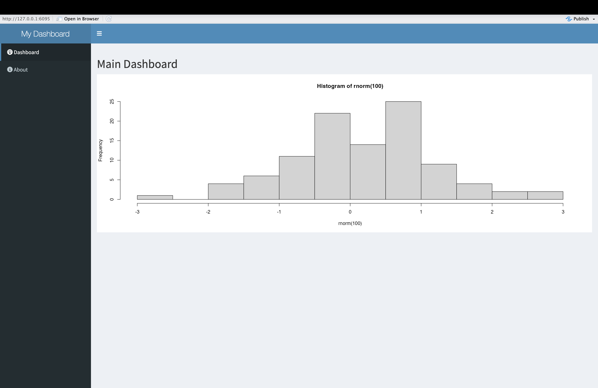

:::::::::::::::::::::::::::::::::::::: questions 

- What is the relationship between the data applications we created in the previous episode, and data dashboards (which we'll create in this one)? 
- What is *shinydashboard*, and what is it's role in the Shiny ecosystem?
- How can *shinydashboard* simplify the dashboard creation process?

::::::::::::::::::::::::::::::::::::::::::::::::

::::::::::::::::::::::::::::::::::::: objectives

- Explore *shinydashboard* and gain practice in using this package to make simple data dashboards. 
- Connect the process of making a dashboard with *shinydashboard* to more general principles of application development in Shiny (introduced in previous episodes)
::::::::::::::::::::::::::::::::::::::::::::::::

## Preliminaries

Before proceeding with this Episode, please install and load the following libraries (if you haven't already done so):


``` r
# load libraries
library(shiny)
library(shinydashboard)
```

``` output

Attaching package: 'shinydashboard'
```

``` output
The following object is masked from 'package:graphics':

    box
```

``` r
library(tidyverse)
```

``` output
── Attaching core tidyverse packages ──────────────────────── tidyverse 2.0.0 ──
✔ dplyr     1.1.4     ✔ readr     2.1.5
✔ forcats   1.0.0     ✔ stringr   1.5.1
✔ ggplot2   3.5.2     ✔ tibble    3.3.0
✔ lubridate 1.9.4     ✔ tidyr     1.3.1
✔ purrr     1.0.4     
```

``` output
── Conflicts ────────────────────────────────────────── tidyverse_conflicts() ──
✖ dplyr::filter() masks stats::filter()
✖ dplyr::lag()    masks stats::lag()
ℹ Use the conflicted package (<http://conflicted.r-lib.org/>) to force all conflicts to become errors
```

``` r
library(nycflights13)
library(DT)
```

``` output

Attaching package: 'DT'

The following objects are masked from 'package:shiny':

    dataTableOutput, renderDataTable
```

## Introduction 

A Shiny data application is an interactive web application lets users explore or manipulate data, including those without data science expertise. In the previous episode, we gained experience in developing such applications by applying some fundamental principles of Shiny application development that we learned earlier. We can think of a data dashboard as a specific kind of Shiny data application, one that emphasizes the display of multiple interrelated pieces of information in a structured, systematic, and visually appealing way. Dashboards can often convey more information than simpler applications, and are well-suited to providing important context and supporting decisionmaking. 

By itself, the base *shiny* package we've been working with has all the tools and functions necessary to create more structured dashboards, but doing so is non-trivial, and requires fairly advanced knowledge of the Shiny environment. That's where the *shinydashboard* package comes in. Part of the broader Shiny ecosystem (i.e. packages adjacent to the core *shiny* package that extend and broaden its functionality, including those we've worked with such as *shinythemes* and *shinyjs*), the *shinydashboard* package provides a suite of functions that make it relatively straighforward to build dashboards using the principles of Shiny application development. The package does much of the work involved in getting from basic Shiny data applications to more multidimensional and context-rich dashboards, which makes it easier than it otherwise would be to make data dashboards using the Shiny tools and principles we've been learning.

At this point, your knowledge of Shiny is sufficiently advanced that picking up *shinydashboard* will be quite manageable; it involves learning some new functions, but as you'll see, the underlying principles at work are the same as the principles that underlie Shiny. Now that you've done the heavy lifting in learning the essentials of Shiny, and have developed some Shiny data applications, that learning curve for *shinydashboard* will be less steep, but still yield a significant payoff. 

## Getting oriented to *shinydashboard* 

As a way of getting oriented to *shinydashboard*, consider the following script, which creates a basic dashboard structure using functions from the *shinydashboard* package. 


``` r
ui <- dashboardPage(                     

  dashboardHeader(                    
    title = "My Dashboard"               
  ),                                    

  dashboardSidebar(                      
    sidebarMenu(                         
      
      menuItem(                          
        "Dashboard",                   
        tabName = "dashboard",         
        icon = icon("dashboard")       
      ),                                 

      menuItem(                          
        "About",                        
        tabName = "about",               
        icon = icon("info-circle")       
      )                                 

    )                                   
  ),                                     

  dashboardBody(                         
    tabItems(                         

      tabItem(                           
        tabName = "dashboard",           
        h2("Main Dashboard"),            
        plotOutput("myplot")            
      ),                                 

      tabItem(                           
        tabName = "about",              
        h2("About This App"),            
        p("This app was built using shinydashboard.")  
      )                                  
    )                                 
  )                                    

)                                     

# Define the server-side logic
server <- function(input, output) {      

  output$myplot <- renderPlot({          
    hist(rnorm(100))                    
  })                               

}                                        

# Run the Shiny application
shinyApp(ui, server)                     
```

When you launch the dashboard application, you will see something that looks like this:

<div class="figure" style="text-align: center">

<p class="caption">Figure 37. Empty Dashboard Application</p>
</div>

::::::::::::::::::::::::::::::::::::: challenge

## Challenge 1: Understand the code to create a dashboard

After launching the (mostly) empty dashboard application structure above, closely examine the dashboard and connect its various features to the parts of the code that created it. Then, as a way of solidifying your understanding, comment the code. Finally, identify some similarities and differences between the code to create a more general Shiny application, and to create a dashboard. 

::: solution

A thoroughly commented version of the script above would look something like this:


``` r
# Define the User Interface (UI)
ui <- dashboardPage(                     # Start the overall dashboard page layout

  dashboardHeader(                       # Define the top header of the dashboard
    title = "My Dashboard"               # Title displayed in the dashboard header
  ),                                     # End of dashboardHeader

  dashboardSidebar(                      # Start the sidebar layout
    sidebarMenu(                         # Create a menu container for sidebar items
      
      menuItem(                          # Create first menu item
        "Dashboard",                     # Text shown in sidebar
        tabName = "dashboard",           # Identifier used to link to tab content
        icon = icon("dashboard")         # Display an icon (text input; still allowed here)
      ),                                 # End of first menuItem

      menuItem(                          # Create second menu item
        "About",                         # Text shown in sidebar
        tabName = "about",               # Identifier for linking to about tab
        icon = icon("info-circle")       # Icon to accompany label
      )                                  # End of second menuItem

    )                                    # End of sidebarMenu
  ),                                     # End of dashboardSidebar

  dashboardBody(                         # Start the main content body of the dashboard
    tabItems(                            # Container that holds tab panels

      tabItem(                           # First tab panel
        tabName = "dashboard",           # Must match tabName in sidebar menu item
        h2("Main Dashboard"),            # Large heading for this tab
        plotOutput("myplot")             # Placeholder for plot to be rendered in server
      ),                                 # End of first tabItem

      tabItem(                           # Second tab panel
        tabName = "about",               # Must match second menu item's tabName
        h2("About This App"),            # Heading for the About section
        p("This app was built using shinydashboard.")  # Informative paragraph
      )                                  # End of second tabItem

    )                                    # End of tabItems container
  )                                      # End of dashboardBody

)                                        # End of dashboardPage definition

# Define the server-side logic
server <- function(input, output) {      # Start server function

  output$myplot <- renderPlot({          # Define a plot output
    hist(rnorm(100))                     # Generate a histogram of 100 random values
  })                                     # End of renderPlot

}                                        # End of server function

# Run the Shiny application
shinyApp(ui, server)                     # Launch the app using the UI and server
```

You'll notice that in broad terms, the code to create a standard application is quite similar to this code to create a dashboard using *shinydashboard* functions. Notice, for example, the structure of the code, which is divided into a section for the UI and one for the server; as before, the application is launched by bringing these elements together within *shinyApp*. The basic logic of a Shiny app is also on display here; space for outputs is reserved in the UI, and these outputs are then populated in the server code. For example, space for the plot created within the ```renderPlot()``` function is reserved with ``` plotOutput("myplot")```, and the plot created in the server is linked back to its UI placeholder using dollar sign notation to reference the output ID. Right now, the dashboard isn't an interactive one that takes in user inputs and automatically updates the outputs in accordance with the principle of reactivity, but you may be able to anticipate this possibility, based on the overall structure of the dashboard application. 

The main difference you'll notice is that the user interface is more structured (with sections such as a sidebar menu and tabbed content) than the interface of a regular application, and this structured interface is implemented using *shinydashboard* functions that help generate a dashboard layout "off the shelf". Note, for example, the use of ```dashboardPage()``` rather than ```fluidPage()``` as the base-level UI function. 

The UI is organized by ```dashboardPage()``` into three main sections:

* **Header**, which shows the dashboard title at the top via ```dashboardHeader()```
* **Sidebar** which shows a vertical panel with a navigation menu on the side, via ```dashboardSidebar()```
* A **Body**, where associated with each tab is displayed, via ```dashboardBody()```

In this example, the sidebar menu of the dashboard includes two menu items:

* One is called "Dashboard", and labeled internally with ```tabName="dashboard"```
* The other is called "About", and labelled internally with ```tabName="about"```

The body of the dashboard has two items, with each one linked to a tab in the sidebar menu.

* The "dashboard" item the body contains a title and plot output.
* the "about" item in the body contains a title and a short paragraph of text.

The items in the dashboard's boy are linked back to their tabs in the sidebar (so that clicking one of the tabs brings the user to the appropriate item in the body) via their internal identifiers. For example, the "dashboard" item in the body is linked to its corresponding tab in the sidebar via ``` tabName = "dashboard"```. 

The syntax on the server side is identical to what you've seen in previous episodes. 

:::

:::::::::::::::::::::::::::::::::::::


## Building a simple flight delay dashboard 

Now that we're oriented to to the basic layout of *shinydashboard* and the code used to generate it, let's get some practice developing a more substantive (yet still relatively simple) dashboard that features an interactive dimension. As in the previous Episode, we'll use flights data from the *nycflights13* package. Building a data dashboard of flight delays will allow us to compare the dashboard to the application we built in the previous lesson, and appreciate the richer options for the display of information offered by the dashboard format.

As before, we'll start by verbally outlining the dashboard, which we'll name "NYC Flights Dashboard":

* For simplicity, we'll only include one menu item in the sidebar, named "Dashboard", corresponding to the main dashboard page. On the sidebar, we'll also include our Month and Day input widgets.
* The body of the dashboard has a single page containing a variety of plots, tables, and value boxes The first row of this page will contain two value boxes containing information on the number of total departing flights, and the average flight delay (we'll reserve space for these boxes using the ```valueBoxOutput()``` placeholder. The second row will contain a plot of the top 10 departure delays for the selected time frame, and a table of the top 5 departure delays; space for the plot is reserved in the UI using ```plotOutput()```, while space for the table is reserved using ```tableOutput()``` (this time, unlike the previous episode, we'll use Shiny's in-built table output functions rather than those from *DT*, so you can see the difference in appearance). Finally, in the third row of the dashboard page, we'll reserve space for a plot of the average delay by destination. * In the server, we'll first create a reactive expression that filters the dataset based on user specifications, and use this expression within a ```renderValueBox()``` function to create the code to display the total number of flights on the selected day. We'll also create a second reactive expression that takes the first reactive expression, and removes the non-delayed flights. This expression will be used to calculate the value for the second value box, i.e. the average delay.
* This second reactive expression will also be used in the subsequent render functions that calculate the output values for the plots and tables specified in the UI. 

When we translate this outline into code, we get something that looks like the following:


``` r
# Define UI
ui <- dashboardPage(
  dashboardHeader(title = "NYC Flights Dashboard"),
  
  dashboardSidebar(
    sidebarMenu(
      menuItem("Dashboard", tabName = "dashboard", icon = icon("plane")),
      selectInput("month", "Month", choices = 1:12, selected = 1), # month selector
      selectInput("day", "Day", choices = 1:31, selected = 1) # day selector
    ) # closes sidebar menu
  ), # closes dashboard sidebar
  
  dashboardBody(
    tabItems(
      tabItem(tabName = "dashboard",
              fluidRow(
                valueBoxOutput("flight_count"),
                valueBoxOutput("avg_delay")
              ), # closes first fluidRow
              fluidRow( # opens second row
                box(title = "Top 10 Departure Delays", width = 6,
                    plotOutput("delay_plot")),
                box(title = "Top 5 Delayed Flights", width = 6,
                    tableOutput("top_delay_table"))
              ), # closes second row
              fluidRow( # opens third row
                box(title = "Average Delay by Destination", width = 12,
                    plotOutput("dest_delay_plot"))
              ) # closes third fluidRow
      ) # closes tabItem 
    ) # closes tabItems
  ) # closes dashboardBody
) # closes dashboardPage

# Define server logic
server <- function(input, output) {
  
  # Reactive dataset for all flights (no dep_delay filter)
  all_flights <- reactive({
    flights %>%
      filter(month == as.numeric(input$month), 
             day == as.numeric(input$day))
  })
  
  # Reactive dataset for flights with non-missing dep_delay
  filtered_flights <- reactive({
    all_flights() %>%
      filter(!is.na(dep_delay))
  })
  
  # Value box for total flights (all flights, including NA dep_delay)
  output$flight_count <- renderValueBox({
    count <- nrow(all_flights())
    valueBox(count, "Flights", icon = icon("plane-departure"), color = "blue")
  })
  
  # Value box for average departure delay
  output$avg_delay <- renderValueBox({
    avg <- round(mean(filtered_flights()$dep_delay, na.rm = TRUE), 1)
    valueBox(paste0(avg, " min"), "Avg. Departure Delay", icon = icon("clock"), color = "orange")
  })
  
  # Bar plot for top 10 departure delays
  output$delay_plot <- renderPlot({
    top10 <- filtered_flights() %>%
      arrange(desc(dep_delay)) %>%
      slice_head(n = 10)
    
    ggplot(top10, aes(x = reorder(paste(carrier, flight), dep_delay), y = dep_delay)) +
      geom_col(fill = "tomato") +
      coord_flip() +
      labs(title = "Top 10 Departure Delays", x = "Flight", y = "Delay (min)") +
      theme_minimal()
  })
  
  # Table of top 5 delayed flights
  output$top_delay_table <- renderTable({
    filtered_flights() %>%
      arrange(desc(dep_delay)) %>%
      slice_head(n = 5) %>%
      select(carrier, flight, dep_delay, dest) %>%
      rename(Airline = carrier, Flight = flight, Delay = dep_delay, Destination = dest)
  })
  
  # Bar plot for average delay by destination
  output$dest_delay_plot <- renderPlot({
    filtered_flights() %>%
      group_by(dest) %>%
      summarise(avg_delay = mean(dep_delay, na.rm = TRUE), n = n()) %>%
      filter(n >= 3) %>%  # Require at least 3 flights for reliability
      ggplot(aes(x = reorder(dest, avg_delay), y = avg_delay)) +
      geom_col(fill = "steelblue") +
      coord_flip() +
      labs(title = "Average Departure Delay by Destination", x = "Destination", y = "Avg. Delay (min)") +
      theme_minimal()
  })
}

# Run the app
shinyApp(ui, server)
```

Some additional things to note about this script:

* Note that within the dashboard's body, tab item is organized into rows using ```fluidRow()```. Each row spans a total width of 12 units. You can arrange content within these rows using boxes of varying widths (for example, three boxes of width 4 or two boxes of width 6, as long as the total does not exceed 12). These boxes function as "containers" for UI elements such as plots, tables, value boxes etc.
* To correctly display value boxes, it's not enough to compute a value inside ```renderValueBox()``` and expect it to appear automatically via its identifier. You must use the ```valueBox()``` function inside ```renderValueBox()``` to explicitly define what should be displayed and how—this ensures the value appears in the intended format in the UI.

When the app is launched, it will look something like this:

<div class="figure" style="text-align: center">

<p class="caption">Figure 38. Flight Delay Dashboard</p>
</div>

::::::::::::::::::::::::::::::::::::: challenge

## Challenge 2: Enhance the flight delay dashboard

Please add a checkbox input to the dashboard that allows users to select their airport(s) of interest. Make sure that the app's outputs update in response to the user's selection of the airport(s). 

::: solution

To add a checkbox-based "airport selector", use ```checkboxGroupInput()``` in the UI; to ensure that this filter is appropriately used in the calculation of the outputs, make sure to update the argument to the ```filter()``` function in the first reactive expression in the server. The revised code will look something like this: 


``` r
# Define UI
ui <- dashboardPage(
  dashboardHeader(title = "NYC Flights Dashboard"),
  
  dashboardSidebar(
    sidebarMenu(
      menuItem("Dashboard", tabName = "dashboard", icon = icon("plane")),
      selectInput("month", "Month", choices = 1:12, selected = 1), # month selector
      selectInput("day", "Day", choices = 1:31, selected = 1), # day selector
      checkboxGroupInput("origin", "Airport of Origin", # airport selector
                         choices=unique(flights$origin), 
                         selecte=unique(flights$origin))
    ) # closes sidebar menu
  ), # closes dashboard sidebar
  
  dashboardBody(
    tabItems(
      tabItem(tabName = "dashboard",
              fluidRow(
                valueBoxOutput("flight_count"),
                valueBoxOutput("avg_delay")
              ), # closes first fluidRow
              fluidRow( # opens second row
                box(title = "Top 10 Departure Delays", width = 6,
                    plotOutput("delay_plot")),
                box(title = "Top 5 Delayed Flights", width = 6,
                    tableOutput("top_delay_table"))
              ), # closes second row
              fluidRow( # opens third row
                box(title = "Average Delay by Destination", width = 12,
                    plotOutput("dest_delay_plot"))
              ) # closes third fluidRow
      ) # closes tabItem 
    ) # closes tabItems
  ) # closes dashboardBody
) # closes dashboardPage

# Define server logic
server <- function(input, output) {
  
  # Reactive dataset for all flights (no dep_delay filter)
  all_flights <- reactive({
    flights %>%
      filter(month == as.numeric(input$month), 
             day == as.numeric(input$day),
             origin %in% input$origin)
  })
  
  # Reactive dataset for flights with non-missing dep_delay
  filtered_flights <- reactive({
    all_flights() %>%
      filter(!is.na(dep_delay))
  })
  
  # Value box for total flights (all flights, including NA dep_delay)
  output$flight_count <- renderValueBox({
    count <- nrow(all_flights())
    valueBox(count, "Flights", icon = icon("plane-departure"), color = "blue")
  })
  
  # Value box for average departure delay
  output$avg_delay <- renderValueBox({
    avg <- round(mean(filtered_flights()$dep_delay, na.rm = TRUE), 1)
    valueBox(paste0(avg, " min"), "Avg. Departure Delay", icon = icon("clock"), color = "orange")
  })
  
  # Bar plot for top 10 departure delays
  output$delay_plot <- renderPlot({
    top10 <- filtered_flights() %>%
      arrange(desc(dep_delay)) %>%
      slice_head(n = 10)
    
    ggplot(top10, aes(x = reorder(paste(carrier, flight), dep_delay), y = dep_delay)) +
      geom_col(fill = "tomato") +
      coord_flip() +
      labs(title = "Top 10 Departure Delays", x = "Flight", y = "Delay (min)") +
      theme_minimal()
  })
  
  # Table of top 5 delayed flights
  output$top_delay_table <- renderTable({
    filtered_flights() %>%
      arrange(desc(dep_delay)) %>%
      slice_head(n = 5) %>%
      select(carrier, flight, dep_delay, dest) %>%
      rename(Airline = carrier, Flight = flight, Delay = dep_delay, Destination = dest)
  })
  
  # Bar plot for average delay by destination
  output$dest_delay_plot <- renderPlot({
    filtered_flights() %>%
      group_by(dest) %>%
      summarise(avg_delay = mean(dep_delay, na.rm = TRUE), n = n()) %>%
      filter(n >= 3) %>%  # Require at least 3 flights for reliability
      ggplot(aes(x = reorder(dest, avg_delay), y = avg_delay)) +
      geom_col(fill = "steelblue") +
      coord_flip() +
      labs(title = "Average Departure Delay by Destination", x = "Destination", y = "Avg. Delay (min)") +
      theme_minimal()
  })
}

# Run the app
shinyApp(ui, server)
```

<!--html_preserve--><iframe data-deferred-src="app4a757e8ba8a45573ce30a5759996dc43/?w=&amp;__subapp__=1" width="100%" height="400" class="shiny-frame shiny-frame-deferred"></iframe><!--/html_preserve-->

The result will look something like this:

<div class="figure" style="text-align: center">

<p class="caption">Figure 39. Flight Delay Dashboard With Airport Selector</p>
</div>

:::

:::::::::::::::::::::::::::::::::::::

::::::::::::::::::::::::::::::::::::: keypoints 

- *shinydashboard* is a package that makes it easier to develop data dashboards using Shiny principles
- We can think of a data dashboard as a specific type of data application with a more structured layout, and the ability to display larger amounts of information in context
- The basic principles involved in building a dashboard with *shinydashboard* are the same as those for any Shiny application, but *shinydashboards* has unique functions associated with the dashboard layout
- In *shinydashboard*, the UI is divided into three main parts: ```dashboardHeader()```, ```dashboardSidebar(```), and ```dashboardBody()```. These allow for a clear separation of the header, navigation sidebar, and main content body, which contributes to a structured, user-friendly layout.
- *shinydashboard* makes it easy to organize content using boxes, value boxes, and fluid rows. Each of these can be customized with specific widths to ensure an optimal layout for displaying information like charts, tables, or textual content.
- Just like any other Shiny application, dashboards can include interactive elements like inputs (e.g., sliders, dropdowns, checkboxes) to filter or modify the displayed data in real time. You can create dynamic outputs using render functions, such as ```renderPlot()``` that are familiar from before, as well as render functions unique to *shinydashboard* such as ```renderValueBox()```. 

::::::::::::::::::::::::::::::::::::::::::::::::

