```{r setup, include=FALSE}
knitr::opts_chunk$set(echo = TRUE)
```

:::::::::::::::::::::::::::::::::::::: questions 

- What are the different components of a Shiny application and how do they fit together?
- How can we create, run, and view a simple Shiny application? 
- How can we create an interactive Shiny application that is responsive to user inputs or requests? 
- How can we customize the appearance of a simple Shiny application? 

::::::::::::::::::::::::::::::::::::::::::::::::

::::::::::::::::::::::::::::::::::::: objectives

- Explain how to use markdown with the new lesson template
- Demonstrate how to include pieces of code, figures, and nested challenge blocks

::::::::::::::::::::::::::::::::::::::::::::::::

## Preliminaries

Before beginning this episode, please load the following libraries"

```{r}
# load libraries
library(shiny)
library(shinythemes)
library(shinyjs)
```


## The Structure of a Shiny Application

At the conclusion of the previous Episode, we examined some currently published Shiny applications. Now, we'll begin peeking "under the hood" to see how these applications are put together, and how they work. Our starting point is the observation that all Shiny applications, no matter how complex, have three fundamental and interrelated building blocks:

* A **user interface (UI)** that specifies the appearance and layout of the application
* A **server** that defines how an application generates outputs in response to user inputs
* A call to the ```shinyApp()``` function, which launches the application by bringing together the **UI** and **server**

The relationship between the user interface and server is dynamic and bi-directional; the server provides substantive content (created using R code) that populates the user interface, while the user interface defines how that content is organized and displayed to users. This may sound fairly abstract, but will hopefully come into focus as we proceed. 

## Our first application: Hello, World! 

In this section, we'll develop our very first Shiny application. There's a good chance that the first (or one of the first) things you did in R was to print a "Hello, World" statement:

```{r}
# prints "Hello, World"
print("Hello, World")
```

Our goal in this section is to wrap this statement into a "Hello, World" Shiny application. 

### A note on application files and directories

First, though, it is important to briefly discuss where to write and store your applications. Ideally, you should create a separate dedicated directory for each application you write. For now, we'll create our application scripts, containing the UI and server code, in a familiar **.R** file (but R Studio does have a handy pre-built template for Shiny applications, which we'll introduce later on). This application directory can also contain other elements relevant to or referenced by your application (such as image files, datasets, Readme files etc.). As applications grow in complexity, it could make sense for you to use subdirectories to organize your main application directory. 

Each R script should only contain the code for a single application; trying to include the code for multiple applications in a single script can cause errors or undefined behavior when you try to launch an application (since Shiny may be confused about which application it's supposed to run). That said, in this episode, we'll be creating and running several simple "toy" applications to illustrate important Shiny features. You can either save each application in separate scripts, or write all of the applications in a single script while commenting out the code for the application(s) you are NOT running; that way, you can write code for several simple applications in one **.R** file, while ensuring that only one script at a time is "live" when you try to launch it. 

### Writing the "Hello, World" application

Let's first write out our application's skeletal structure, translating the three components we discussed above (the UI, server, and ```shinyApp()```) into actual Shiny code. After getting this structure down, we'll fill in elements to create the "Hello, World" application below. Recall from above that the application's UI defines how the application *looks* (i.e. what are the inputs and outputs, and how are they visually displayed), the server defines what the application *does* and how it works (i.e. how inputs are processed to generate outputs), and the call to ```shinyApp()``` brings these elements together to launch the application. 

```{r, eval=FALSE}
# UI: Layout and inputs/outputs go here
ui <- fluidPage(
  # Add UI code (specifying application's inputs, outputs, and layouts) here
)

# Server: Logic and reactivity go here
server <- function(input, output) {
  # Add server code (specifying application's content) here
}

# Launch the app 
shinyApp(ui, server)
```

Some aspects of this code require additional clarification.

* The ```fluidPage()``` function used in the creation of the UI object is a Shiny layout function that creates a responsive web page layout that automatically adjusts to different screen sizes. The arguments to ```fluidPage()```, will contain additional functions that define the user interface. 
* Within the server function, "input" is used to access values the user has entered or selected in the UI, while "output" is used to define the content that is displayed within the UI. Sometimes, in more complex applications with more sophisticated user interfaces, you will also see a "session" argument in the server function, but that is beyond the scope of our current workshop. 

Again, this may still seem a little but abstract, but will hopefully come into focus as we proceed. You can launch an application from your script by simply running the UI and server code, along with with ```shinyApp(ui, server)```:

```{r, fig:launching-app, fig.cap="Figure 2. Launching an App", echo=F}
knitr::include_graphics("fig/fig2-launching-app.png")
```

Since our application is still empty, launching it will generate a blank page that looks something like this:

```{r, echo=F, fig:blank-page, fig.cap="Figure 3. A Blank Application"}
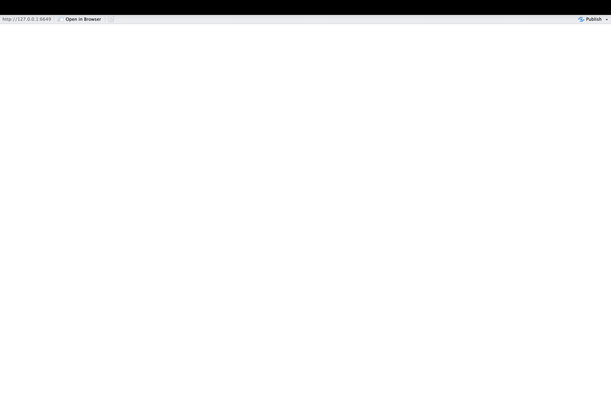
```

Now, let's go ahead and create our "Hello, World" app by adding this text to the application structure we've defined above. It may not seem intuitive at first, but we'll unpack it after writing out the code and launching the application. 

```{r, eval=FALSE}
# UI: Layout and inputs/outputs go here
ui <- fluidPage(
  textOutput(outputId="greeting")  # Placeholder for text
)

# Server: Logic and reactivity go here
server <- function(input, output) {
  # Add server code (specifying application's text)
  output$greeting <- renderText({
    "Hello, World!"  # application content
  })
}

# Launch the app
shinyApp(ui, server)
```

When you go ahead and launch this application from your .R file, you'll see something that looks like this:

```{r, echo=F, fig:hello-world, fig.cap="Figure 4. The 'Hello, World!' Application"}
knitr::include_graphics("fig/fig4-hello-world.png")
```

Congratulations on writing your first Shiny application!

This application was simple--it's just a blank web page with "Hello, World!" written on it--but it's certainly less intuitive than printing that string to the console with ```Hello, World```. The code above needs some unpacking:

* ```textOutput()``` is one of Shiny's UI output functions; it creates a placeholder in the user interface for a text string that will be defined in the server. The argument to this function, "greeting", is an arbitrary identifier that will be used to link the text string defined in the server back to this placeholder in the user interface. To learn more about ```textOutput()``` please consult the documentation with ```?textOutput()```. 
* After creating the placeholder for text output in the UI, the server defines what text will be displayed in the UI  with ```output$greeting <- renderText({"Hello, World!"})```. ```renderText()``` is a server-side output function used to generate the text displayed in the placeholder created by ```textOutput()```. In Shiny, ```output()``` is a special object that is used to store content that will be displayed in the UI. Shiny uses dollar sign notation to assign the content in the output object to a specific UI placeholder, identified by its output ID. Here, ```output$greeting``` connects the rendered text to the UI placeholder identified by ```outputId="greeting"```. 

::::::::::::::::::::::::::::::::::::: callout

In Shiny, output functions determine what gets displayed in the application. These are used to show text, plots, tables, or other content, either by reserving space in the UI (UI output functions) or by generating content in the server (server-side output functions). 

* Output functions in the UI are sometimes referred to as "placeholder functions" because they reserve space in the UI where content created in the server will appear. 

* Output functions in the server are sometimes referred to as "render functions", because they generate (or "render") the content that fills the placeholders defined in the UI. 

Each render function in the server has a matching placeholder in the UI. For example, in the simple "Hello, World!" app, the placeholder function ```textOutput()``` reserves space in the UI, while the corresponding render function ```renderText()``` generates the text that will be shown there. 

Shiny connects the two using ```output$id``` where "id" matches the identifier given to the placeholder.The content returned by the render function is displayed in the UI at the location specified by the placeholder. 

::::::::::::::::::::::::::::::::::::::::::::::::

::::::::::::::::::::::::::::::::::::: challenge 

## Challenge 1: Make your own text app

Using what you've learned above, make your own basic Shiny application that communicates a message in simple text. Rather than simply modifying the "Hello, World!" app, write it from scratch; this will help you become familiar with Shiny's syntax. 
:::::::::::::::::::::::::::::::::::::

## Displaying a plot in a Shiny application

Instead of printing a text string in our application, let's instead create a Shiny application that displays a simple plot that's generated with some R code. Below, we generate 1000 random values from a normal distribution with a mean of 0 and a standard deviation of 1, and assign the resulting vector to a new object named ```samples```. We then plot a histogram of the ```samples``` data that's divided into 30 bins:

```{r}
# create a vector of 1000 randomly generated values from a normal distribution with a mean of 0 and SD of 1
samples <- rnorm(1000, mean = 0, sd = 1)

# make a histogram of "samples" data
hist(samples, breaks = 30, col = "skyblue",
     main = "Histogram of Normal Samples",
     xlab = "Value")
```

Let's wrap this histogram into a simple Shiny app; we'll do so in much the same way we wrapped "Hello, World" into a Shiny app, with some minor adjustments to account for the fact that we want to display a plot, rather than text. In particular, we'll use a new set of output functions designed specifically for plots (rather than output functions designed for text, as above). Let's start by first creating the skeletal structure for a blank application:

```{r, eval=F}
# UI: Layout and inputs/outputs go here
ui <- fluidPage(
  # Add UI code (specifying application's inputs, outputs, and layouts) here
)

# Server: Logic and reactivity go here
server <- function(input, output) {
  # Add server code (specifying application's content) here
}

# Launch the app 
shinyApp(ui, server)
```

Now, let's begin populating the application:

* In the "Hello, World!" application, we didn't make a title for the application. That can be a useful thing to do, so here, we'll create a title for the application using Shiny's ```titlePanel()``` function. We'll name the application "Exploring the Normal Distribution", which we can pass as an argument to ```titlePanel()``` in the UI. 
* We'll create a placeholder for the plot in the UI using Shiny's ```plotOutput()``` function, and use "normal_plot" as the output ID. Note that different elements in the UI are separated by a comma (in this case, a comma separates the ```titlePanel()``` and ```plotOutput()``` functions) 
* Then, in the server, we'll wrap the code to make our plot within the ```renderPlot()``` function, and assign this output back to the UI using the "normal_plot" ID.  

Our application code should look something like this:

```{r, eval=F}
# UI: Layout and inputs/outputs go here
ui <- fluidPage(
  # Add UI code (specifying application's inputs, outputs, and layouts) here
  titlePanel("Exploring the Normal Distribution"),
  plotOutput(outputId = "normal_plot")
)

# Server: Logic and reactivity go here
server <- function(input, output) {
  # Add server code (specifying application's content) here
  output$normal_plot<-renderPlot({
    # create vector
    samples <- rnorm(1000, mean = 0, sd = 1)
    
    # make a histogram of "samples" data
    hist(samples, breaks = 30, col = "skyblue",
         main = "Histogram of Normal Samples",
         xlab = "Value")
  })
}

# Launch the app 
shinyApp(ui, server)
```

When you're ready, go ahead and launch the application. It will look something like this:

```{r, echo=FALSE, fig:exploring-normal, fig.cap="Figure 5. The Normal Plot Application"}
knitr::include_graphics("fig/fig5-exploring-normal.png")
```

## Applications with multiple outputs 

The "Hello, World!" application displayed a text output, while the app we just created displayed a plot output. There's no reason why a Shiny application cannot include many different types of outputs (indeed, most "real world" Shiny apps do!). Let's now make a slightly more complex application that incorporates both text and plot outputs; we'll use the same plot as above, and add some text to provide some additional context, using ```textOutput()``` to create a placeholder in the UI, and the ```renderText()``` function to create the message we'd like to display. The output created using ```renderText()``` is assigned back to the UI placeholder by using dollar sign notation to reference the output ID specified in ```textOutput()```. Your application code should look something like the following:

```{r, eval=F}
# UI: Layout and inputs/outputs go here
ui <- fluidPage(
  # Add UI code (specifying application's inputs, outputs, and layouts) here
  titlePanel("Exploring the Normal Distribution"),
  textOutput(outputId="context_discussion"),
  plotOutput(outputId = "normal_plot")
)

# Server: Logic and reactivity go here
server <- function(input, output) {
  # Add server code (specifying application's content) here
  
  # creates text output
  output$context_discussion<-renderText({
    "This histogram shows 1,000 values randomly drawn from a standard normal distribution. Most values fall between -3 and 3, with a peak around 0."
  })
  
  # creates plot output
  output$normal_plot<-renderPlot({
    # create vector
    samples <- rnorm(1000, mean = 0, sd = 1)
    
    # make a histogram of "samples" data
    hist(samples, breaks = 30, col = "skyblue",
         main = "Histogram of Normal Samples",
         xlab = "Value")
  })
}

# Launch the app 
shinyApp(ui, server)
```

Now, let's go ahead and launch our application, and see what it looks like:

```{r, echo=FALSE, fig:exploring-normal-text, fig.cap="Figure 6. The Normal Plot Application With Text"}
knitr::include_graphics("fig/fig6-exploring-normal-text.png")
```

Note the text above the plot in this modified application.

::::::::::::::::::::::::::::::::::::: challenge

## Challenge 2: Change an application's layout

In the application we just created, the written text providing relevant context is situated above the plot. Modify the application code so that it's instead below the plot. 

::: solution

To make this change, you can simply move ``` textOutput()``` function below the ```plotOutput()``` function in the UI. There is no need to change the order of anything in the server; the order in which elements is displayed is solely governed by the UI code. The code for a modified application with the text element below the plot looks as follows:

```{r, eval=F}
# UI: Layout and inputs/outputs go here
ui <- fluidPage(
  # Add UI code (specifying application's inputs, outputs, and layouts) here
  titlePanel("Exploring the Normal Distribution"),
  plotOutput(outputId = "normal_plot"),
  textOutput(outputId="context_discussion")
)

# Server: Logic and reactivity go here
server <- function(input, output) {
  # Add server code (specifying application's content) here
  
  # creates text output
  output$context_discussion<-renderText({
    "This histogram shows 1,000 values randomly drawn from a standard normal distribution. Most values fall between -3 and 3, with a peak around 0."
  })
  
  # creates plot output
  output$normal_plot<-renderPlot({
    # create vector
    samples <- rnorm(1000, mean = 0, sd = 1)
    
    # make a histogram of "samples" data
    hist(samples, breaks = 30, col = "skyblue",
         main = "Histogram of Normal Samples",
         xlab = "Value")
  })
}

# Launch the app 
shinyApp(ui, server)
```

:::

:::::::::::::::::::::::::::::::::::::

## A conceptual overview of interactive applications

So far, we have learned about the basic structure of Shiny applications and how to populate them with content by linking output functions in the UI (placeholder functions) with output functions in the server (render functions). You may have noticed that the applications we have built so far are static, in the sense that they don't respond dynamically to user input. However, static applications have limited utility, and much of the power and usefulness of Shiny applications comes from their ability to dynamically respond to user input. 

### Input Functions

To build dynamic, interactive applications, we need to introduce a new class of Shiny functions: input functions. Input functions are UI functions that create interactive elements where users can enter or select information (such as text boxes, sliders, check boxes, or radio buttons). This user input can then determine what gets displayed in the app. 

For example, imagine an app that contains some text output in the UI, and radio buttons that let the user choose a language. If the user selects "English", the text appears in English; if they select "Spanish", it appears in Spanish. The function that creates these radio buttons in Shiny is considered an input function.

### Reactivity

In Shiny, applications respond to user input by automatically recalculating and updating outputs whenever their underlying inputs change. For example, if a user adjusts a slider input specifying a date range, any outputs depending on that slider (i.e. a plot, text, table etc.) will automatically update without needing to refresh or re-run the app. This concept is known as *reactivity*.

Reactivity is built into Shiny functions. For example, the server-side ```renderPlot()``` function can explicitly reference input values (we'll see how to do this below); the plot will automatically re-render whenever the user changes a relevant input value. In other words, render functions "listen" for changes in inputs and update their output value accordingly. 

It's worth highlighting how unique reactive behavior in Shiny is, compared to the way the R programming language works more generally. In particular, traditional R code is emphatically *not* reactive. To make this more concrete, let's consider an example. First, we'll define two new objects, ```x``` and ```y```"

```{r}
# defines objects x and y
x<-5
y<-x+1
```

As expected, we can see the value of ```y``` is 6:

```{r}
# prints value of y
y
```

Now, let's change the value of of ```x``` to 10:

```{r}
# assigns new value of 10 to object x
x<-10
```

Now, what is the value of ```y```? As you likely know from your previous experience with R, the value of y would remain unchanged:

```{r}
# prints value of y
y
```

This is the essence of *non-reactive* behavior: R does not automatically re-calculate the value of ```y``` after the change in ```x```. In order for the updated value of ```x``` to be reflected in the value of ```y```, it would be necessary to re-run ```y<-x+1```. However, in a reactive context such as Shiny, outputs automatically update whenever their dependent inputs change. For example, if ```x``` were controlled by a user input (e.g. a slider), and ```y``` was displayed in the app using ```renderText()```, then an app user updating the slider would automatically trigger a recalculation of y, without needing to re-run any code. This is the essence of reactivity in Shiny: it allows your applications to respond automatically to user input, without manual intervention or re-running code. 

## Writing interactive applications

With those concepts in mind, let's now turn to writing some simple interactive applications that use input functions and utilize Shiny's reactive capabilities. We'll start by modifying our previous "Hello, World!" application. Rather than having the application always display the same static "Hello, World!" greeting, we'll allow the user to enter their own greeting using a text box. By default, the app will display "Hello, World!", but users can replace this with a custom message-making the application dynamic and interactive (though still, of course, very simple). We can generate such an application with the following:

### Interactive Greeting Applications

```{r, eval=F}
# UI: Layout and inputs/outputs go here
ui <- fluidPage(
  titlePanel("Greeting Application"),
  
  # Input: Text box for user to input their own message
  textInput(inputId = "user_input", label = "Enter your greeting:", value = "Hello, World!"),
  
  # Output: Display the greeting
  textOutput(outputId = "greeting")
)

# Server: Logic and reactivity go here
server <- function(input, output) {
  
  # Reactive output based on user input
  output$greeting <- renderText({
    paste0(input$user_input)  # Dynamically update the greeting based on input
  })
}

# Launch the app 
shinyApp(ui, server)

```

Let's unpack the code above:

* We use the ```titlePanel()``` function in the UI to give the application a title, "Greeting Application". 
* We then call ```textInput()``` within the UI. This is an input function that creates a text box where users can type in a custom greeting. Just as output placeholder functions have identifiers that can be used to refer to them in the server, so do input functions. The first argument, ```inputId="user_input"```, gives the input a unique ID. The second argument specifies a label that users will see above the text box. Finally, the "value" argument specifies the default starting value for the text box. 
* The final element of the UI is a call to ```textOutput()```, which reserves space in the UI for displaying the greeting. The argument to this function is an ID used in the server to link the actual output to this placeholder.
* In the server, we use ```renderText()``` to specify the output text that will be shown. We reference the user's input using ```input$user_input``` and return it using ```paste0()``` to create the final output. The use of ```input$user_input``` to refer to the user-supplied input within the ```renderText()``` function ensures the output updates automatically whenever the user changes their input. This demonstrates reactivity in action. 

When you run the application, you'll initially get a result that looks like this:

```{r, echo=FALSE, fig:greeting-interactive, fig.cap="Figure 7. The Interactive Greeting App with Default Value"}
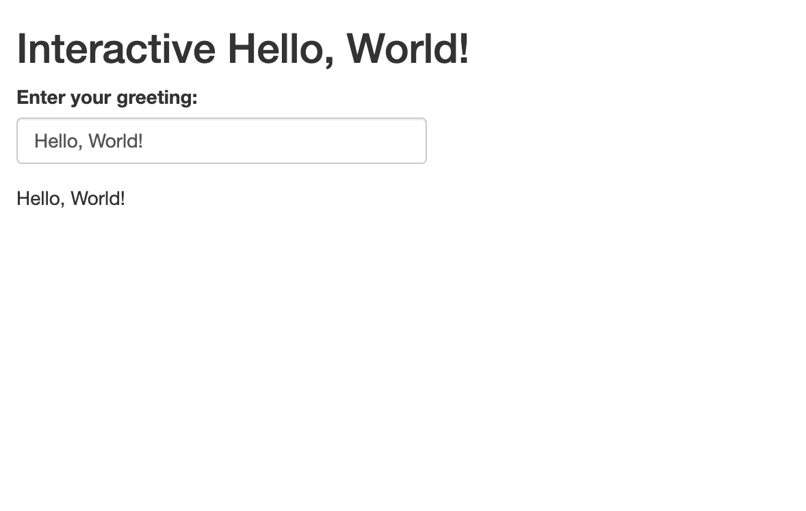
```

When you change the value in the text box, the output text will also change. For example, if we go ahead and change the greeting in the text box to "Hi there :)", this change will be reflected in the output:

```{r, echo=FALSE, fig:greeting-interactive-modified, fig.cap="Figure 8. The Interactive Greeting App with a new user-supplied input"}
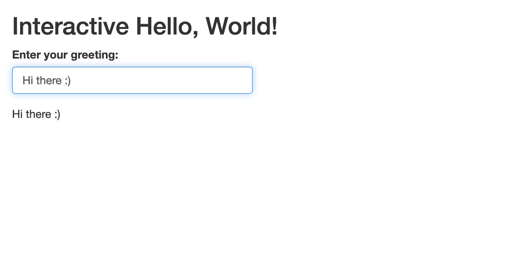
```

Let's now tweak this "greeting" application, which will help you become familiar with another input function, and get some more practice writing reactive code. In particular, instead of letting users write any text they wish into the text box, let's modify the app to invite users to select a greeting from a drop-down menu that presents a few different greetings to choose from; the chosen greeting will be printed as the output. We can keep all aspects of the code for the initial greeting application the same; we just have to change the input function from ```textInput()``` (which creates a text box) to ```selectInput()``` which creates a drop-down menu with choices defined within one of the function's arguments. For more information, check the ```selectInput()``` function's documentation. The modified code will look something like this:

```{r, eval=F}
# UI: Layout and inputs/outputs go here
ui <- fluidPage(
  titlePanel("Greeting Application"),
  
  # Input: Dropdown menu for user to select a greeting
  selectInput(
    inputId = "user_input",
    label = "Choose your greeting:",
    choices = c("Hello, World!", "Hi there :)", "What's up?", "Nice to meet you"),
    selected = "Hello, World!"
  ),
  
  # Output: Display the selected greeting
  textOutput(outputId = "greeting")
)

# Server: Logic and reactivity go here
server <- function(input, output) {
  
  # Reactive output based on selected greeting
  output$greeting <- renderText({
    input$user_input  # Display the selected greeting
  })
}

# Launch the app 
shinyApp(ui, server)
```

When it is launched, the app looks something like this:

```{r, echo=FALSE, fig:greeting-interactive-dropdown, fig.cap="Figure 9. The Interactive Greeting App with dropdown Menu"}
knitr::include_graphics("fig/fig9-greeting-dropdown-launch.png")
```

The user can select the desired greeting from the drop-down menu; let's say they want the "Nice to meet you" greeting:

```{r, echo=FALSE, fig:greeting-interactive-dropdown-select, fig.cap="Figure 10. Selecting an option from the interactive greeting app's dropdown menu"}
knitr::include_graphics("fig/fig10-greeting-dropdown-select.png")
```

After the selection is made, the corresponding text is printed as text output:

```{r, echo=FALSE, fig:greeting-interactive-dropdown-output, fig.cap="Figure 11. Text output after selecting an input from the dropdown menu"}
knitr::include_graphics("fig/fig11-greeting-dropdown-output.png")
```

::::::::::::::::::::::::::::::::::::: challenge

## Challenge 3: Modify the greeting application to use radio buttons

Replace the drop down menu in the app we just created with radio buttons, using the ```radioButtons()``` input function. You may have to consult the function's documentation to specify the necessary arguments. Make sure to create a label, and a default selection. Use the same greeting options we used for the dropdown menu above. 

::: solution

To make this change, you can replace ```selectInput()``` with ```radioButtons()```, while keeping the remaining code unchanged. It will look something like this: 

```{r, eval=F}
# UI: Layout and inputs/outputs go here
ui <- fluidPage(
  titlePanel("Greeting Application"),
  
  # Input: Radio buttons for user to select a greeting
  radioButtons(
    inputId = "user_input",
    label = "Choose your greeting:",
    choices = c("Hello, World!", "Hi there :)", "What's up?", "Nice to meet you"),
    selected = "Hello, World!"
  ),
  
  # Output: Display the selected greeting
  textOutput(outputId = "greeting")
)

# Server: Logic and reactivity go here
server <- function(input, output) {
  
  # Reactive output based on selected greeting
  output$greeting <- renderText({
    input$user_input
  })
}

# Launch the app 
shinyApp(ui, server)

```

Once launched, the modified application will look something like this:

```{r, echo=FALSE, fig:greeting-interactive-radio, fig.cap="Figure 12. Greeting App with Radio Buttons"}
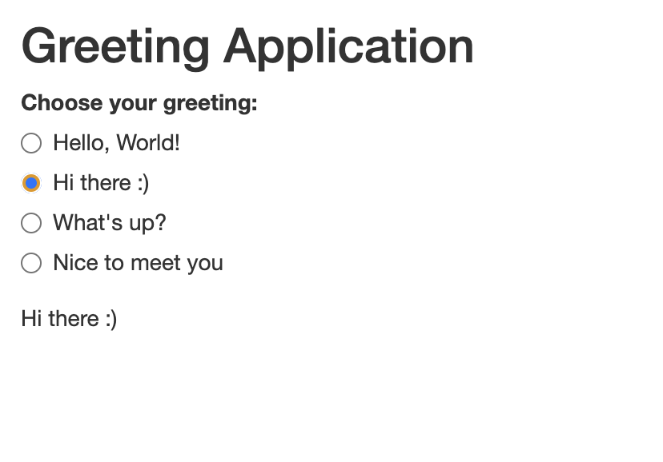
```

:::

:::::::::::::::::::::::::::::::::::::

Let's now create a slightly different greeting app in which the user provides their name, and the application responds with a personal greeting. We can develop this application with some now-familiar functions:

```{r, eval=F}
# UI
ui <- fluidPage(
  titlePanel("Personal Greeting App"),

  # Text input for the user's name
  textInput(inputId="name", label="What is your name?"),

  # Output: Greeting text
  textOutput(outputId="greeting")
)

# Server
server <- function(input, output) {
  output$greeting <- renderText({
    paste0("Hello, ", input$name, "! Nice to meet you.")
  })
}

# Run the app
shinyApp(ui = ui, server = server)
```

When you launch the application, it looks something like this:

```{r, echo=FALSE, fig:greeting-interactive-personal, fig.cap="Figure 13. Personal Greeting App"}
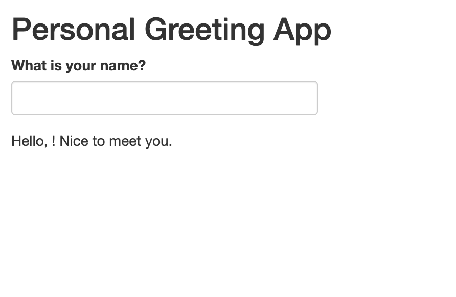
```

When a name is typed into the text box, the output updates accordingly:

```{r, echo=FALSE, fig:greeting-interactive-personal-filled, fig.cap="Figure 14. Personal Greeting App Output"}
knitr::include_graphics("fig/fig14-personal-greeting-name.png")
```

One potential design limitation of this simple application is that before the name is entered into the text box, the output "Hello, ! Nice to meet you." looks awkward. It may be desirable to hide this output before the name is entered, and only show the complete output once the name is actually entered into the box. We can accomplish this by inserting the conditional statement ```if (input$name == "") return(NULL)``` in the ```renderText()``` function before the ```paste0()``` function. This essentially says "If the name field is blank, do not return an output." The modified script looks like this:

```{r, eval=F}
# UI
ui <- fluidPage(
  titlePanel("Personal Greeting App"),

  # Text input for the user's name
  textInput(inputId="name", label="What is your name?"),

  # Output: Greeting text
  textOutput(outputId="greeting")
)

# Server
server <- function(input, output) {
  output$greeting <- renderText({
   if (input$name == "") return(NULL)
    paste0("Hello, ", input$name, "! Nice to meet you.")
  })
}

# Run the app
shinyApp(ui = ui, server = server)
```

Now, when we launch the app, we'll see an interface that looks like this:

```{r, echo=FALSE, fig:greeting-interactive-personal-blank, fig.cap="Figure 15. Launching the Revised Personal Greeting App"}
knitr::include_graphics("fig/fig15-revised-personal-greeting-blank.png")
```

The application will return the full output in response to the user entering their name in the text field:

```{r, echo=FALSE, fig:greeting-interactive-revised-personal-filled, fig.cap="Figure 16. User-Prompted Output in the Revised Personal Greeting App"}
knitr::include_graphics("fig/fig16-revised-personal-greeting-filled.png")
```

Let's build on this to make a slighly more complex personal greeting application. In particular, we'll write an application that requests two different inputs from the user, using two different methods. We'll ask the user their name, which they'll supply in a text box. We'll also ask the user if this is their first Carpentries workshop, which they'll answer by filling in a radio button (Yes/No). If it is their first Carpentries workshop, the following text output is returned: "Hello, <NAME>. Welcome to the Carpentries!". If it is NOT their first Carpentries workshop, the following text output is returned: "Hello, <NAME>. Welcome back to the Carpentries!". 

This interactive application is more complex than the others we've written so far, but uses techniques and functions we're already familiar with. The UI includes two input functions, ```textInput()``` and ```radioButtons``` that are referenced in the server, within conditional statements in the ```renderText()``` function:

```{r, eval=F}
# UI
ui <- fluidPage(
  titlePanel("Carpentries Greeting"),

  # Ask for user's name
  textInput(inputId = "name", label="What is your name?"),

  # Ask if they're new
  radioButtons(inputId = "new", 
               label = "Are you new to the Carpentries?",
               choices = c("Yes", "No"), 
                selected = character(0)), # No default selection

  # Display greeting
  textOutput(outputId = "greeting")
)

# Server
server <- function(input, output) {
  output$greeting <- renderText({
     # Don't show anything unless both inputs are filled
    if (input$name == "" || is.null(input$new)) return(NULL)

    # Build greeting based on response
    if (input$new == "Yes") {
      paste0("Hello ", input$name, ", welcome to the Carpentries.")
    } else if (input$new == "No") {
      paste0("Hello ", input$name, ", welcome back to the Carpentries.")
    } else {
      NULL  # If no radio button is selected yet
    }
  })
}

# Run the app
shinyApp(ui = ui, server = server)
```

When the resulting app is launched, it looks like this:

```{r, echo=FALSE, fig:carpentries-introduction, fig.cap="Figure 17.Carpentries Introduction App"}
knitr::include_graphics("fig/fig17-carpentries-introduction.png")
```

After the user provides their name and clicks the relevant radio button, the text output responds with the appropriate message:

```{r, echo=FALSE, fig:carpentries-introduction-output, fig.cap="Figure 18.Carpentries Introduction App Text Output"}
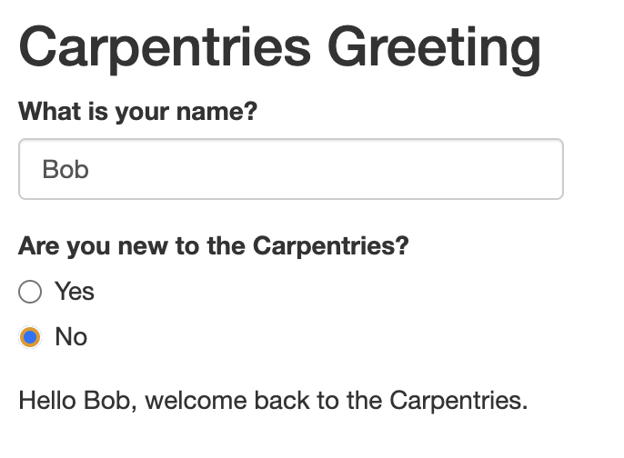
```

::::::::::::::::::::::::::::::::::::: challenge

## Challenge 4: Explain the logic of the Carpentries greeting app in your own words

Work with a partner, and in your own words, take turns explaining how the application we've just written is put together. Focus on input functions, output functions, and the server logic. 

::: solution

Here is a sample explanation: This Shiny app has two main parts: the UI (user interface) and the server (logic). In the UI, we use ```textInput()``` to ask the user for their name and ```radioButtons()``` to ask whether they are new to the Carpentries. We set ```selected = character(0)``` in the radio button to ensure that no option is selected by default. We also include ```textOutput()``` as a placeholder where the final greeting message will appear. 

In the server function, we use ```renderText()``` to generate the greeting based on the user's input. Inside ```renderText()```, the line ```if (input$name == "" || is.null(input$new)) return(NULL)``` plays an important role: it tells the app to hold off on showing any message until both the name and the radio button response are provided. The ```input$name == ""``` part checks whether the name text box is empty. The ```is.null(input$new)``` part checks whether the user has not yet selected a radio button. The ```||``` means "or" — so if either of these conditions is true, the function returns NULL (i.e., nothing is shown). Once both inputs are present, the app uses ```paste0()``` to construct a personalized greeting, depending on whether the user selected "Yes" or "No", and displays it using the ```textOutput()``` placeholder.

:::

:::::::::::::::::::::::::::::::::::::


### Interactive Plot Applications

Having explored several interactive variations on our static "Hello, World!" application, let's now turn to our static plot application above, and turn it into an interactive application using Shiny's reactive functions. Let's modify the code we used to create the static plot, and use reactive input functions to allow users to specify the number of bins in the histogram. To do so, we'll use ```numericInput()``` within the UI, which gives users a text box in which they can specify the desired number of bins; in the server, we'll replace the number 30 with ```input$desired_bins```, which sets the "breaks" argument equal to the number specified by the user (using dollar sign notation to reference this number using the ```numericInput``` function's input ID): 

```{r, eval=F}
# UI: Layout and inputs/outputs go here
ui <- fluidPage(
  # Add UI code (specifying application's inputs, outputs, and layouts) here
  titlePanel("Exploring the Normal Distribution"),
  numericInput(inputId = "desired_bins", 
               label="Please enter the desired number of bins",
               value=30),
  plotOutput(outputId = "normal_plot"),
  textOutput(outputId="context_discussion")
)

# Server: Logic and reactivity go here
server <- function(input, output) {
  # Add server code (specifying application's content) here
  
  # creates text output
  output$context_discussion<-renderText({
    "This histogram shows 1,000 values randomly drawn from a standard normal distribution. Most values fall between -3 and 3, with a peak around 0."
  })
  
  # creates plot output
  output$normal_plot<-renderPlot({
    # create vector
    samples <- rnorm(1000, mean = 0, sd = 1)
    
    # make a histogram of "samples" data
    hist(samples, breaks = input$desired_bins, col = "skyblue",
         main = "Histogram of Normal Samples",
         xlab = "Value")
  })
}

# Launch the app 
shinyApp(ui, server)
```

When we launch the application, we see a numeric textbox with the default value set to 30 (the number of bins we had in our static application):


```{r, echo=FALSE, fig:interactive-normal, fig.cap="Figure 19.Launching the interactive plot application"}
knitr::include_graphics("fig/fig19-interactive-normal.png")
```

However, the desired number of bins can now be changed by the user, and the plot will respond accordingly. For example, let's change the number of bins to 100:

```{r, echo=FALSE, fig:interactive-normal-changed-bins, fig.cap="Figure 20. Increasing the number of bins to 100"}
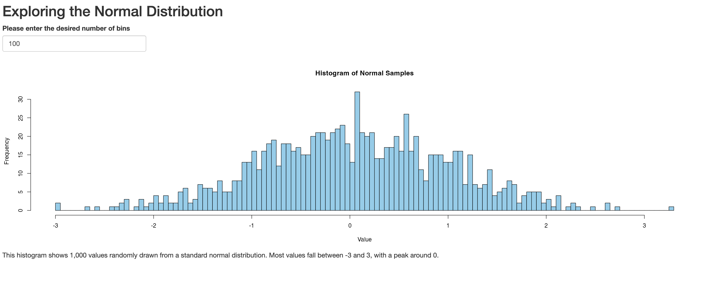
```

Let's add another interactive dimension to this application by allowing users to change the color of the plot. We'll create a text input field where a user can type in a color, based on [color codes used in R](https://www.nceas.ucsb.edu/sites/default/files/2020-04/colorPaletteCheatsheet.pdf
). We'll place this text box below the numeric input box, and create it using the ```textInput()``` function; we'll refer back to the user specified color in the server using dollar sign notation in conjunction with the ID argument passed to ```textInput()```:

```{r, eval=F}
# UI: Layout and inputs/outputs go here
ui <- fluidPage(
  # Add UI code (specifying application's inputs, outputs, and layouts) here
  titlePanel("Exploring the Normal Distribution"),
  numericInput(inputId = "desired_bins", 
               label="Please enter the desired number of bins",
               value=30),
  textInput(inputId="desired_color",
            label="Please enter the desired color for the histogram",
            value="skyblue"),
  plotOutput(outputId = "normal_plot"),
  textOutput(outputId="context_discussion")
)

# Server: Logic and reactivity go here
server <- function(input, output) {
  # Add server code (specifying application's content) here
  
  # creates text output
  output$context_discussion<-renderText({
    "This histogram shows 1,000 values randomly drawn from a standard normal distribution. Most values fall between -3 and 3, with a peak around 0."
  })
  
  # creates plot output
  output$normal_plot<-renderPlot({
    # create vector
    samples <- rnorm(1000, mean = 0, sd = 1)
    
    # make a histogram of "samples" data
    hist(samples, breaks = input$desired_bins, col = input$desired_color,
         main = "Histogram of Normal Samples",
         xlab = "Value")
  })
}

# Launch the app 
shinyApp(ui, server)
```

Let's launch the app, set the number of bins to 60, and the color to "orangered". It will look something like this:

```{r, echo=FALSE, fig:interactive-normal-changed-bins-colors, fig.cap="Figure 21. Interactively changing number of bins and colors"}
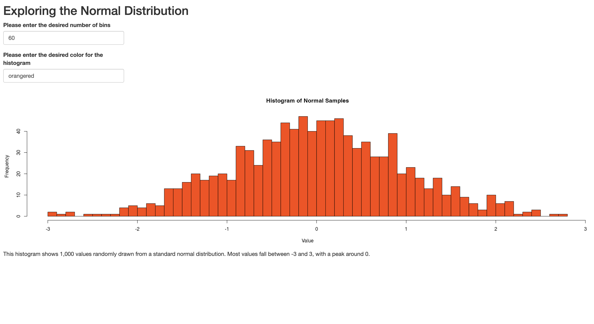
```

::::::::::::::::::::::::::::::::::::: challenge

## Challenge 5: Modify the interactive plot application

Modify the interactive plot application in the following ways:

* Instead of inviting users to specify their desired color in a textbox, constrain their choices by asking them to select one of the following colors from a dropdown menu: skyblue, orangered, violet, lightcyan, or lawngreen. 
* Remove the contextual discussion (i.e. "This histogram shows...)
* Create a numeric input field where users can specify a desired mean for the sample.

::: solution

Your script should look something like this:

```{r, eval=F}
# UI: Layout and inputs/outputs go here
ui <- fluidPage(
  # Add UI code (specifying application's inputs, outputs, and layouts) here
  titlePanel("Exploring the Normal Distribution"),
  numericInput(inputId = "desired_bins", 
               label="Please enter the desired number of bins",
               value=30),
  selectInput(inputId="desired_color",
            label="Please select the desired color for the histogram",
            choices=c("skyblue", "orangered", "violet", "lightcyan", "lawngreen")),
  numericInput(inputId="desired_mean", label="Please enter the desired population mean", value=0),
  plotOutput(outputId = "normal_plot"),
)

# Server: Logic and reactivity go here
server <- function(input, output) {
  # Add server code (specifying application's content) here
  
  # creates plot output
  output$normal_plot<-renderPlot({
    # create vector
    samples <- rnorm(1000, mean = input$desired_mean, sd = 1)
    
    # make a histogram of "samples" data
    hist(samples, breaks = input$desired_bins, col = input$desired_color,
         main = "Histogram of Normal Samples",
         xlab = "Value")
  })
}

# Launch the app 
shinyApp(ui, server)
```

Once the app is launched, if we were to set the number of bins to 100, select "lawngreen" as the color, and choose a mean of 45, we will get something that looks like the following:

```{r, echo=FALSE, fig:interactive-normal-mean, fig.cap="Figure 21. Interactive plot with user inputs for color, number of bins, and mean"}
knitr::include_graphics("fig/fig22-interactive-normal-bins-colors-means.png")
```

:::

:::::::::::::::::::::::::::::::::::::

## Layouts and Themes

We'll use the app you just created in the exercise above to explore some basic tools that can be used to lay out the elements within your application, as well as style the application as a whole.

### Sidebar layouts

First, note that the user inputs in the app you created were laid out on top of the plot. Often, it can be preferable to situate these elements towards the side. Indeed, one of the most useful Shiny application layouts is known as the sidebar layout, in which there is a sidebar for inputs, and a "main" panel for outputs. To see how the sidebar layout works, let's wrap the application we wrote in the previous exercise into a sidebar layout, with the inputs on the side, and the plot in the main panel:

```{r, eval=F}
ui <- fluidPage(
  # Add UI code (specifying application's inputs, outputs, and layouts) here
  titlePanel("Exploring the Normal Distribution"),
  
  sidebarLayout(
    sidebarPanel(
      numericInput(inputId = "desired_bins", 
                   label = "Please enter the desired number of bins",
                   value = 30),
      
      selectInput(inputId = "desired_color",
                  label = "Please select the desired color for the histogram",
                  choices = c("skyblue", "orangered", "violet", "lightcyan", "lawngreen")),
      
      numericInput(inputId = "desired_mean", 
                   label = "Please enter the desired population mean", 
                   value = 0)
    ), # closes sidebarPanel
    
    mainPanel(
      plotOutput(outputId = "normal_plot")
    ) # closes mainPanel
  ) # closes sidebarLayout
) # closes fluidPage


# Server: Logic and reactivity go here
server <- function(input, output) {
  # Add server code (specifying application's content) here
  
  # creates plot output
  output$normal_plot <- renderPlot({
    # create vector
    samples <- rnorm(1000, mean = input$desired_mean, sd = 1)
    
    # make a histogram of "samples" data
    hist(samples, breaks = input$desired_bins, col = input$desired_color,
         main = "Histogram of Normal Samples",
         xlab = "Value")
  })
}

# Launch the app 
shinyApp(ui, server)
```

As you can see, the ```sidebarLayout()``` function declares a sidebar structure; within this function, relevant input widgets are placed within ```sidebarPanel()```, and the outputs to be displayed within the main panel are placed within ```sidebarPanel()```. Once this sidebar structure is in place, the revised app will look like the following:

```{r, echo=FALSE, fig:sidebar-layout, fig.cap="Figure 23. Sidebar layout"}
knitr::include_graphics("fig/fig23-sidebar.png")
```

If you wanted to place the input widgets to the right of the main panel, you can do so by specifying ```position="right" within ```sidebarLayout()```, right before calling ```sidebarPanel()```. The modified script would look like this:

```{r, eval=F}
ui <- fluidPage(
  # Add UI code (specifying application's inputs, outputs, and layouts) here
  titlePanel("Exploring the Normal Distribution"),
  
  sidebarLayout(
    position="right",
    sidebarPanel(
      numericInput(inputId = "desired_bins", 
                   label = "Please enter the desired number of bins",
                   value = 30),
      
      selectInput(inputId = "desired_color",
                  label = "Please select the desired color for the histogram",
                  choices = c("skyblue", "orangered", "violet", "lightcyan", "lawngreen")),
      
      numericInput(inputId = "desired_mean", 
                   label = "Please enter the desired population mean", 
                   value = 0)
    ), # closes sidebarPanel
    
    mainPanel(
      plotOutput(outputId = "normal_plot")
    ) # closes mainPanel
  ) # closes sidebarLayout
) # closes fluidPage


# Server: Logic and reactivity go here
server <- function(input, output) {
  # Add server code (specifying application's content) here
  
  # creates plot output
  output$normal_plot <- renderPlot({
    # create vector
    samples <- rnorm(1000, mean = input$desired_mean, sd = 1)
    
    # make a histogram of "samples" data
    hist(samples, breaks = input$desired_bins, col = input$desired_color,
         main = "Histogram of Normal Samples",
         xlab = "Value")
  })
}

# Launch the app 
shinyApp(ui, server)
```

Yielding an application with the inputs on the right, as expected: 

```{r, echo=FALSE, fig:sidebar-layout-right, fig.cap="Figure 24. Sidebar layout with inputs on the right"}
knitr::include_graphics("fig/fig24-sidebar-right.png")
```

Recall, from above, that if we want the input widgets below the main plot, we could remove the sidebar layout, and place the input widgets below the plot output in the UI:

```{r, eval=F}
# UI: Layout and inputs/outputs go here
ui <- fluidPage(
  # Add UI code (specifying application's inputs, outputs, and layouts) here
  titlePanel("Exploring the Normal Distribution"),
  plotOutput(outputId = "normal_plot"),
  numericInput(inputId = "desired_bins", 
               label="Please enter the desired number of bins",
               value=30),
  selectInput(inputId="desired_color",
            label="Please select the desired color for the histogram",
            choices=c("skyblue", "orangered", "violet", "lightcyan", "lawngreen")),
  numericInput(inputId="desired_mean", label="Please enter the desired population mean", value=0),
)

# Server: Logic and reactivity go here
server <- function(input, output) {
  # Add server code (specifying application's content) here
  
  # creates plot output
  output$normal_plot<-renderPlot({
    # create vector
    samples <- rnorm(1000, mean = input$desired_mean, sd = 1)
    
    # make a histogram of "samples" data
    hist(samples, breaks = input$desired_bins, col = input$desired_color,
         main = "Histogram of Normal Samples",
         xlab = "Value")
  })
}

# Launch the app 
shinyApp(ui, server)
```

This minor adjustment in the UI leads to an app with the following appearance:

```{r, echo=FALSE, fig:inputs-bottom, fig.cap="Figure 25. Inputs on the bottom"}
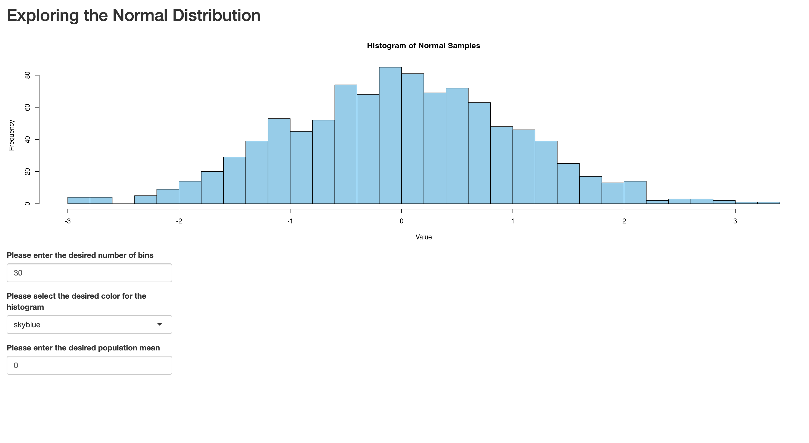
```

### Tabs

So far, our apps have been fairly simple, but as they grow in complexity and the amount of information displayed increases, it can be helpful to use tabs as an organizational tool. Tabs allow us to distribute content across multiple panels, reducing clutter and creating a more streamlined and user-friendly design. In Shiny, we can use the ```tabsetPanel()``` function to organize the content into tabs. Each individual tab is then defined using the tabPanel() function, where the material for that tab is placed. Below, we demonstrate the use of tabs by placing the plot in one tab (the tab is named "Histogram"), and then place some contextual information in another tab (named "Explanation"). 

```{r, eval=F}
# UI
ui <- fluidPage(
  titlePanel("Exploring the Normal Distribution"),
  
  sidebarLayout(
    sidebarPanel(
      numericInput(inputId = "desired_bins", 
                   label = "Please enter the desired number of bins",
                   value = 30),
      
      selectInput(inputId = "desired_color",
                  label = "Please select the desired color for the histogram",
                  choices = c("skyblue", "orangered", "violet", "lightcyan", "lawngreen")),
      
      numericInput(inputId = "desired_mean", 
                   label = "Please enter the desired population mean", 
                   value = 0)
    ), # closes sidebarPanel
    
    mainPanel(
      tabsetPanel(
        tabPanel(title="Histogram", 
                 plotOutput(outputId = "normal_plot")),
        tabPanel(title="Explanation", 
                 textOutput(outputId = "context_discussion"))
      ) # closes tabsetPanel
    ) # closes mainPanel
  ) # closes sidebarLayout
) # closes fluidPage

# Server
server <- function(input, output) {
  
  output$normal_plot <- renderPlot({
    samples <- rnorm(1000, mean = input$desired_mean, sd = 1)
    
    hist(samples, breaks = input$desired_bins, col = input$desired_color,
         main = "Histogram of Normal Samples",
         xlab = "Value")
  })
  
  output$context_discussion <- renderText({
    "This histogram shows 1,000 values drawn from a normal distribution with the specified mean. 
    You can change the number of bins and the histogram color using the controls on the right."
  })
}

# Run the app
shinyApp(ui = ui, server = server)
```

When launched, this tab-based app looks something like this; note the "Histogram" tab is live:

```{r, echo=FALSE, fig:tab-histogram, fig.cap="Figure 26. Tab based app with Histogram tab open"}
knitr::include_graphics("fig/fig26-tab1.png")
```

When the user toggles to the "Explanation" tab, it looks like this:

```{r, echo=FALSE, fig:tab-histogram-explanation, fig.cap="Figure 27. Tab based app with Explanation tab open"}
knitr::include_graphics("fig/fig27-tab2.png")
```

### Themes

Issues of application design and style are complex issues, and many of them are beyond the scope of our Workshop. However, we will briefly introduce themes, which can help shape the visual appearance of your applications with relatively little effort. Shiny themes come from the *shinythemes* package, and you can add a theme to your app with one line of code. Before deciding on a theme, you'd probably want to preview various options, which you can do with the ```themeSelector()``` function. Let's explore various themes that could be applied to the tab-based app we made above:

```{r, eval=F}
# UI
ui <- fluidPage(
  themeSelector(),
  titlePanel("Exploring the Normal Distribution"),
  sidebarLayout(
    sidebarPanel(
      numericInput(inputId = "desired_bins", 
                   label = "Please enter the desired number of bins",
                   value = 30),
      
      selectInput(inputId = "desired_color",
                  label = "Please select the desired color for the histogram",
                  choices = c("skyblue", "orangered", "violet", "lightcyan", "lawngreen")),
      
      numericInput(inputId = "desired_mean", 
                   label = "Please enter the desired population mean", 
                   value = 0)
    ), # closes sidebarPanel
    
    mainPanel(
      tabsetPanel(
        tabPanel(title="Histogram", 
                 plotOutput(outputId = "normal_plot")),
        tabPanel(title="Explanation", 
                 textOutput(outputId = "context_discussion"))
      ) # closes tabsetPanel
    ) # closes mainPanel
  ) # closes sidebarLayout
) # closes fluidPage

# Server
server <- function(input, output) {
  
  output$normal_plot <- renderPlot({
    samples <- rnorm(1000, mean = input$desired_mean, sd = 1)
    
    hist(samples, breaks = input$desired_bins, col = input$desired_color,
         main = "Histogram of Normal Samples",
         xlab = "Value")
  })
  
  output$context_discussion <- renderText({
    "This histogram shows 1,000 values drawn from a normal distribution with the specified mean. 
    You can change the number of bins and the histogram color using the controls on the right."
  })
}

# Run the app
shinyApp(ui = ui, server = server)
```

When you launch this app, it will launch with a drop-down menu that allows you to select and preview how various themes look in the context of your app:

```{r, echo=FALSE, fig:theme-selector, fig.cap="Figure 28. Shiny theme selector"}
knitr::include_graphics("fig/fig28-theme-selector.png")
```

After previewing the various themes, let's say you decide you want to select the "slate" theme. To apply that theme, replace ```themeSelector()``` in the code with ```theme=shinytheme("superhero")```:

```{r, eval=F}
# UI
ui <- fluidPage(
  theme=shinytheme("superhero"),
  titlePanel("Exploring the Normal Distribution"),
  sidebarLayout(
    sidebarPanel(
      numericInput(inputId = "desired_bins", 
                   label = "Please enter the desired number of bins",
                   value = 30),
      
      selectInput(inputId = "desired_color",
                  label = "Please select the desired color for the histogram",
                  choices = c("skyblue", "orangered", "violet", "lightcyan", "lawngreen")),
      
      numericInput(inputId = "desired_mean", 
                   label = "Please enter the desired population mean", 
                   value = 0)
    ), # closes sidebarPanel
    
    mainPanel(
      tabsetPanel(
        tabPanel(title="Histogram", 
                 plotOutput(outputId = "normal_plot")),
        tabPanel(title="Explanation", 
                 textOutput(outputId = "context_discussion"))
      ) # closes tabsetPanel
    ) # closes mainPanel
  ) # closes sidebarLayout
) # closes fluidPage

# Server
server <- function(input, output) {
  
  output$normal_plot <- renderPlot({
    samples <- rnorm(1000, mean = input$desired_mean, sd = 1)
    
    hist(samples, breaks = input$desired_bins, col = input$desired_color,
         main = "Histogram of Normal Samples",
         xlab = "Value")
  })
  
  output$context_discussion <- renderText({
    "This histogram shows 1,000 values drawn from a normal distribution with the specified mean. 
    You can change the number of bins and the histogram color using the controls on the right."
  })
}

# Run the app
shinyApp(ui = ui, server = server)
```

Now, when the app is launched, you'll see the theme is applied:

```{r, echo=FALSE, fig:superhero-theme, fig.cap="Figure 29. Shiny superhero theme"}
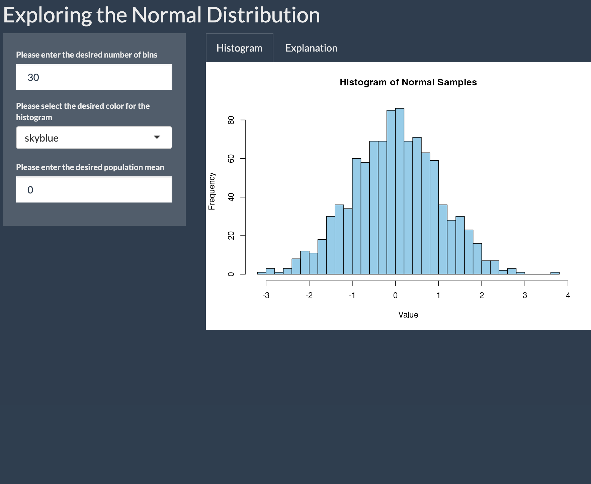
```

## Advanced Reactivity

As we noted above, in a reactive programming context, a change in an input (triggered by a user) automatically triggers an update in all downstream outputs that depend on that input. Shiny's suite of input and output functions, which we are becoming familiar with, facilitate this reactivity, making it possible to develop interactive applications in a relatively straightforward way. Now that we have some more experience in Shiny's reactive programming context, this section will introduce some more advanced tools and concepts related to reactivity. 

### Reactive conductors and the ```reactive()``` function

In considering reactive programming within Shiny, it's helpful to distinguish between the following:

* **Reactive Sources** are the values provided by the user through UI widgets created by input functions
* **Reactive Endpoints** are outputs that depend on reactive sources. These include render functions like ```renderText()``` or ```renderPlot()```, which respond to input changes and update the UI accordingly.
* **Reactive conductors** sit in between sources and endpoints. They are created using the ```reactive()``` function and are used to process or transform input values before they reach the endpoints. They can help reduce code duplication, and improve efficiency. 

These reactive conductors are particularly useful when multiple outputs depend on the same derived value. Without a conductor, you'd have to repeat the same calculation in every render function. For example, in a Fahrenheit-to-Celsius conversion app with multiple outputs that display the Celsius temperature in different ways, it would be inefficient to recompute the conversion in each output. Instead, you can use a reactive conductor to perform the conversion once, and then reference it in each render function. This makes your code cleaner, avoids duplication, and improves efficiency.

Let's consider an example. We'll make a tip calculator application that takes as input your bill, and the desired tip (as a percentage). It then returns the dollar value of the tip (based on the bill and desired tip percentage), and the total value of the bill (including the tip). Note that in the process we'll also introduce a new input widget, the slider bar, which is created with ```sliderInput()```:

```{r, eval=F}
# Define the user interface
ui <- fluidPage(
  titlePanel("Tip Calculator"),  # App title displayed at the top
  
  sidebarLayout(
    sidebarPanel(  # Sidebar contains input controls
      numericInput("bill", "Bill amount ($):", value = 50, min = 0),  # Input for bill amount
      sliderInput("tip", "Tip percentage:", min = 0, max = 30, value = 15)  # Slider for tip %
    ),
    
    mainPanel(  # Main panel displays output
      textOutput("tip_amount"),   # Displays computed tip amount
      textOutput("total_amount")  # Displays computed total amount (bill + tip)
    ) # closes mainPanel
  ) # closes sidebarLayout
) # closes fluidPage

# Define the server logic
server <- function(input, output) {
  
  # Calculate and display the tip amount
  output$tip_amount <- renderText({
    tip_amt <- input$bill * input$tip / 100  # Calculate tip as a percentage of the bill
    paste("Tip amount: $", round(tip_amt, 2))  # Create a string to display the result
  })
  
  # Calculate and display the total amount
  output$total_amount <- renderText({
    tip_amt <- input$bill * input$tip / 100         # Recalculate tip again (duplicated logic)
    total_amt <- input$bill + tip_amt               # Add tip to bill for total
    paste("Total amount: $", round(total_amt, 2))   # Display total
  })
}

# Run the Shiny app
shinyApp(ui, server)
```

This yields an application that looks like the following:

```{r, echo=FALSE, fig:tip-calculator-initial, fig.cap="Figure 30. Tip calculator"}
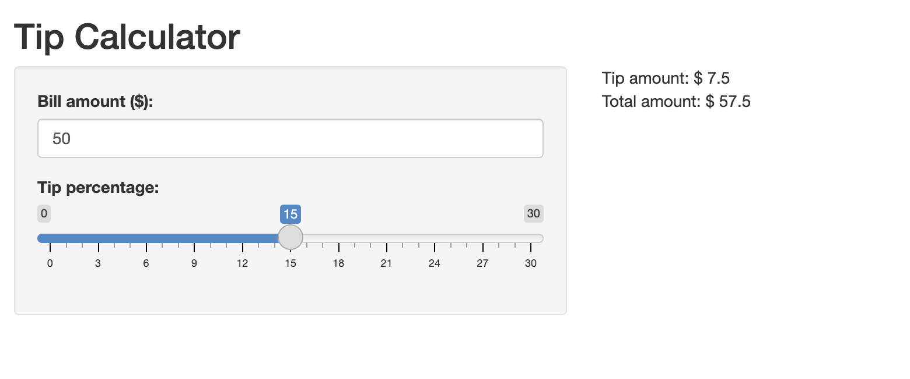
```

The app looks and works as expected, but note that the code used to create it involved some duplication (which the comments in the code call attention to). In particular ```tip_amt <- input$bill * input$tip / 100``` is repeated in both the ```tip_amount``` and ```total_amount``` endpoints. You might wonder why ```tip_amt``` can't be reused after it's initially defined in  ```output$tip_amount```; the reason is that the value of ```tip_amt``` calculated inside the first ```renderText()``` id local to that block of code. It is not remembered or shared across other render functions. More generally, each render function is its own reactive context; variables defined within one of these contexts only exist there. 

Given that's the case, you might wonder whether you can define a function in the server to calculate ```tip_amt```, and then use that function within render functions to avoid code duplication. The answer is that this won't work; in particular, regular user-defined functions are not reactive, so they won't automatically update when input values change. 

The solution to avoid code duplication of this sort is the ```reactive()``` function. Below, we'll rewrite the script above, this time using the ```reactive()``` function to calculate ```tip_amt```, which we'll then subsequently use in different endpoints without having to recalculate anything:

```{r, eval=F}
ui <- fluidPage(
  titlePanel("Tip Calculator"),
  sidebarLayout(
    sidebarPanel(
      numericInput("bill", "Bill amount ($):", value = 50, min = 0),
      sliderInput("tip", "Tip percentage:", min = 0, max = 30, value = 15)
    ),
    mainPanel(
      textOutput("tip_amount"),
      textOutput("total_amount")
    ) # closes mainPanel
  ) # closes sidebarLayout
) # closes fluidPage

server <- function(input, output) {
  
  # Reactive conductor: compute tip once and reuse it
  tip_amt <- reactive({
    input$bill * input$tip / 100
  })
  
  output$tip_amount <- renderText({
    paste("Tip amount: $", round(tip_amt(), 2))
  })
  
  output$total_amount <- renderText({
    total <- input$bill + tip_amt()
    paste("Total amount: $", round(total, 2))
  })
}

shinyApp(ui, server)

```

Above, ```tip_amount()``` is turned into a reactive expression by being enclosed in ```reactive()``` and is subsequently used in both of the subsequent render functions, which helps avoid code duplication. Note that when referring to a reactive expression, the name of the expression must be followed by (), as in ```tip_amt()```. 

Consider the benefits of using ```reactive()```, even in this simple application:

* It avoids duplication and increases efficiency: Tip amount is calculated once in the ```reactive()``` expression, instead of being repeated in each output block. This can improve app performance, particularly in more complex settings. 
* Improves maintainability: If you need to change how the tip is calculated, you only need to update it in one place

The ability to define custom reactive conductors with ```reactive()``` is especially useful when creating applications based on datasets, which we will explore in the next episode. If you are still a little hazy on what exactly ```reactive()``` does or why it's useful, it will become clearer then. 

### Controlling Reactivity with eventReactive()

In the apps we've created so far, application outputs automatically update whenever an input changes. Often, however, it can be useful to control or delay reactivity, such that an update only happens when a specific event occurs (such as the user clicking a button). Delaying reactivity in this way can improve a user experience and conserve computational resources.

A useful Shiny function for controlling reactivity in this way is ```eventReactive()```. Below, we modify the tip calculator application to only run when the user clicks a button that says "Calculate Tip". To do so, we make two changes:

* We include the ```actionButton()``` function in the UI, which creates the button users must click to trigger a calculation
* Instead of using ```reactive()``` to calculate the tip, we wrap the calculation in ```eventReactive()```. This tells Shiny to update the tip (and all downstream outputs) only when the **Calculate Tip** button is clicked. 

```{r, eval=F}
ui <- fluidPage(
  titlePanel("Tip Calculator"),
  sidebarLayout(
    sidebarPanel(
      numericInput("bill", "Bill amount ($):", value = 50, min = 0),
      sliderInput("tip", "Tip percentage:", min = 0, max = 30, value = 15),
      actionButton("calc_btn", "Calculate Tip")
    ),
    mainPanel(
      textOutput("tip_amount"),
      textOutput("total_amount")
    ) # closes mainPanel
  ) # closes sidebarLayout
) # closes fluidPage

server <- function(input, output) {
  
  # Reactive conductor: compute tip once and reuse it
  tip_amt <- eventReactive(input$calc_btn, {
    input$bill * input$tip / 100
  })
  
  # create output of tip amount
  output$tip_amount <- renderText({
    paste("Tip amount: $", round(tip_amt(), 2))
  })
  
  # create output of total amount
  output$total_amount <- renderText({
    total <- input$bill + tip_amt()
    paste("Total amount: $", round(total, 2))
  })
}

shinyApp(ui, server)

```

When you launch the newly revised application, it will look something like this: 

```{r, echo=FALSE, fig:tip-calculator-button, fig.cap="Figure 31. Tip calculator with activation button"}
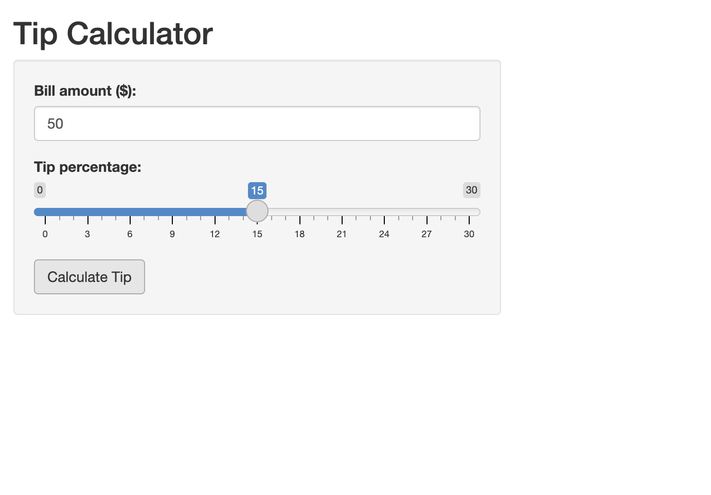
```

Now, the application will only "run" (i.e. return the relevant outputs) after the user sets the input parameters and clicks the "Calculate Tip" button.

### Observers

In Shiny, observers are functions that watch for changes in inputs, and then trigger actions that 
don’t directly produce outputs shown in the app's user interface, but still affect how the app behaves. These actions are called "side effects" because they influence the app in ways other than updating visible output (for example, showing a message, resetting a form, saving data to a file etc). Unlike reactive expressions, which calculate values to update the UI, observers don’t return values. Instead, they simply carry out a task when something changes. Shiny provides two kinds of observers: ```observe()```, which runs code whenever any of its inputs change, and ```observeEvent()```, which waits for a specific event (like a button click) before running. We can think of ```observe()``` and ```observeEvent()``` as counterparts to ```reactive()``` and ```observeReactive()```, but instead of computing values for outputs, they trigger side effects that change the app’s behavior.

To make this more concrete, let's see how ```observe()``` and ```observeEvent()``` can be used to enrich our tip calculator app. In particular, we'll use ```observe()``` to grey out the "Calculate Tip" button if the Bill amount entered by the user is 0. We'll also use ```observeEvent()``` to reset the input parameters to their default state when a "Reset" button is clicked; in addition, when "Reset" is clicked and the input parameters are reset to their default, the output values in the app are erased; when the "Calculate" button is clicked again, the output values are once again displayed: 

```{r, eval=F}
ui <- fluidPage(
  useShinyjs(),  # Initialize shinyjs
  titlePanel("Tip Calculator"),
  sidebarLayout(
    sidebarPanel(
      numericInput("bill", "Bill amount ($):", value = 50, min = 0),
      sliderInput("tip", "Tip percentage:", min = 0, max = 30, value = 15),
      actionButton("calc_btn", "Calculate Tip"),
      actionButton("reset_btn", "Reset")
    ),
    mainPanel(
      textOutput("tip_amount"),  
      textOutput("total_amount")
    )
  )
)

server <- function(input, output, session) {
  
  # Reactive conductor: calculate tip when button is clicked
  tip_amt <- eventReactive(input$calc_btn, {
    input$bill * input$tip / 100
  })
  
  # Disable "Calculate Tip" button when bill is 0
  observe({
    if (input$bill == 0) {
      shinyjs::disable("calc_btn")
    } else {
      shinyjs::enable("calc_btn")
    }
  })
  
  # create output of tip amount
  output$tip_amount <- renderText({
    paste("Tip amount: $", round(tip_amt(), 2))
  })
  
  # create output of total amount
  output$total_amount <- renderText({
    total <- input$bill + tip_amt()
    paste("Total amount: $", round(total, 2))
  })
  
  # Reset form and clear outputs when the "reset" button is clicked
  observeEvent(input$reset_btn, {
    updateNumericInput(session, "bill", value = 50)  # Reset bill to 50
    updateSliderInput(session, "tip", value = 15)    # Reset tip to 15
    shinyjs::hide("tip_amount")                     # Hide tip output
    shinyjs::hide("total_amount")                   # Hide total output
  })
  
  # Show outputs when "calculate" button is clicked 
  observeEvent(input$calc_btn, {
    shinyjs::show("tip_amount")    # Show tip output
    shinyjs::show("total_amount")  # Show total output
  })
}

shinyApp(ui, server)
```

A couple of points are worth highlighting about these changes to the code. 

* You'll notice that we use functions from the *shinyjs* package inside our observers. *Shinyjs* is a package within the tidyverse ecosystem that offers a variety of functions that can improve the user experience. We used the functions ```enable()``` and ```disable()``` to enable or disable the "Calculate Tip" button depending on a condition. We also used it to hide outputs after a user resets the application, and show outputs after a user clicks the "Calculate Tip" button again. 
* Note the tasks the observers are accomplishing, such as disabling or enabling buttons or resetting the form to default values. This underscores our earlier point that observers perform tasks in response to inputs, and thereby shape the app's behavior; however, they do not actually compute values used in outputs (as reactive expressions do). Note, also, the difference between ```observe()``` and ```observeEvent()``` in action; the former produces its side-effect (i.e. disabling the button) whenever the input value for the bill is 0, while the latter produces its side effects (i.e. resetting the form and clearing or restoring outputs) in response to a specific trigger. 
* In response to a user clicking the reset button, code within an observer function hides output, and restores this output when the "Calculate Tip" button is again clicked. This may seem to contradict our earlier point, that observers do not actually impact outputs, but trigger side effects that are relevant for the app's behavior. It's important to note, though, that these "hiding" and "showing" effects modify the UI's appearance via JavaScript/CSS (via the *shinyjs* functions) rather than altering the reactive values or computations that drive the outputs, and are therefore best understood as side effects.  
* Note that we included the "session" argument to the server function this time, because of the way in which the side effects of the observer function impact the UI. The details are too technical to get into here, but the basic point is that in apps with multiple concurrent users, the session object ensures that updates (triggered, for example, by the reset button) are applied to the correct user's instance of the app. 

::::::::::::::::::::::::::::::::::::: callout

One advanced reactivity function that we won't cover in detail, but which you should be aware of, is ```isolate()```. The ```isolate()``` function lets you access an input value without making your code react to it. In other words, ```isolate()``` lets you use an input while disabling Shiny's default behavior of automatically updating outputs in response to input changes. This is helpful when you want to use an input—like a name or a comment—in your output, but don’t want changes to that input to automatically rerun your calculations or update your results. Just like other reactivity functions, ```isolate()``` gives you more control over how and when your app responds to changes. You'll want to be aware of ```isolate()```, particularly if you go on to use Shiny extensively in the future, and anticipate developing sophisticated applications; for our purposes now, however, the reactivity functions we've already covered are more fundamental. 

::::::::::::::::::::::::::::::::::::::::::::::::

::::::::::::::::::::::::::::::::::::: challenge

## Challenge 6: Create a button-activated Fahrenheit to Celsius converter application

Write a Fahrenheit to Celsius converter application in which the user enters a Fahrenheit temperature, and can convert this value to its Celsius equivalent by clicking a button.

::: solution

Your application code should look something like this:

```{r, eval=F}
ui <- fluidPage(
  titlePanel("Fahrenheit to Celsius Converter"),
  sidebarLayout(
    sidebarPanel(
      numericInput("temp_f", "Temperature in Fahrenheit:", value = NULL),
      actionButton("convert_btn", "Convert")
    ),
    mainPanel(
      textOutput("result")
    )
  )
)

server <- function(input, output, session) {
  temp_celsius <- eventReactive(input$convert_btn, {
    (input$temp_f - 32) * 5 / 9
  })
  
  output$result <- renderText({
    paste("Temperature in Celsius:", round(temp_celsius(), 1), "°C")
  })
}

shinyApp(ui, server)
```

Once the app is launched, it looks something like this:

```{r, echo=FALSE, fig:fahrenheit-celsius, fig.cap="Figure 32. The Fahrenheit to Celsius Converter App with Activation Button"}
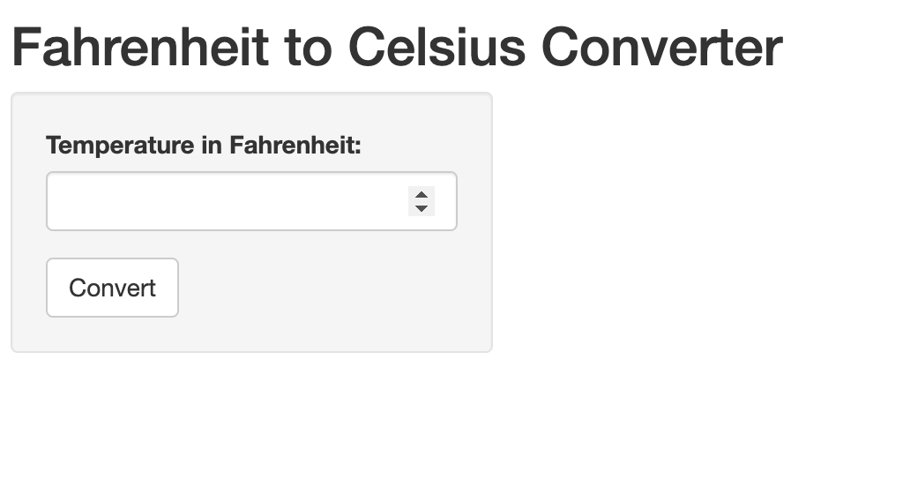
```

Entering a temperature value in the text box, and then clicking "Convert", should trigger the application to make the required conversion display the Celsius temperature equivalent. 

:::

:::::::::::::::::::::::::::::::::::::

::::::::::::::::::::::::::::::::::::: keypoints 

- The fundamental building blocks of all Shiny applications are the user interface (UI) and the server. Shiny apps are launched by combining the UI and server with the shinyApp() function.
- Output functions serve two purposes: in the UI, they act as placeholders for content; in the server, their corresponding render functions generate content to be displayed. It's possible to build a static Shiny application using only outputs, without any inputs.
- Input functions create various widgets (such as text boxes, sliders, menus etc.) that allow users to interact with an application by specifying input values. By default, changes in inputs automatically trigger updates in outputs—this behavior is called reactivity. Input values are referenced in the server using their unique IDs.
- Reactive expressions (also known as reactive conductors) created with ```reactive()``` sit between inputs and outputs, allowing you to process or transform input values before they're displayed. They help reduce duplication and improve performance.
- Observers created with ```observe()``` let you perform side effects—tasks that respond to changes but do not return values (e.g., resetting inputs, enabling/disabling buttons, or saving files). They affect app behavior rather than generating output.
- Functions such as ```eventReactive()``` and ```observeEvent()``` provide more control over when reactivity occurs. They are useful for delaying updates until a specific event (like a button click) happens. Use ```eventReactive()``` when producing outputs and ```observeEvent()``` for behavior changes that don't involve rendering output. 
- Layouts and themes help organize and style your app. Use sidebar layout and tabs to arrange components clearly. Style templates from the *shinythemes* package can give your app a polished look with minimal effort.


::::::::::::::::::::::::::::::::::::::::::::::::

