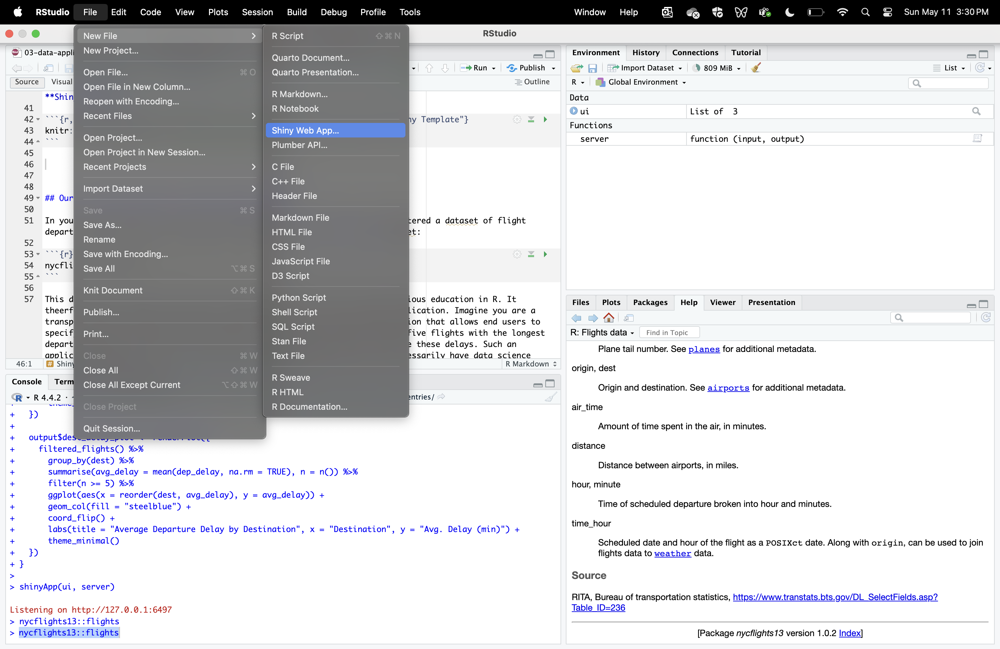
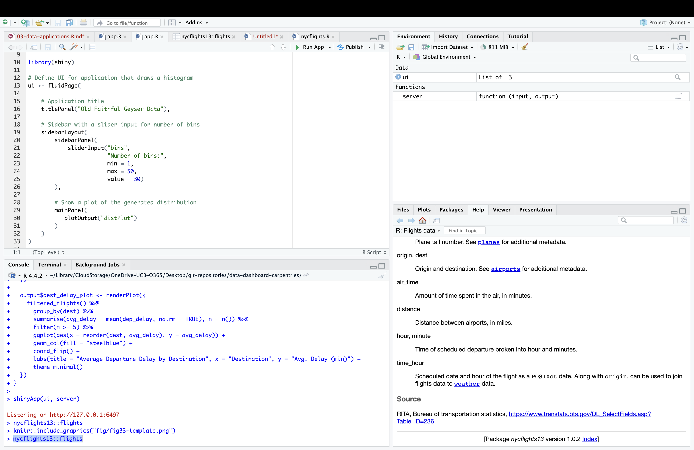
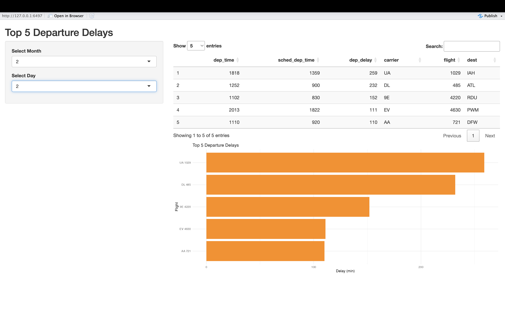
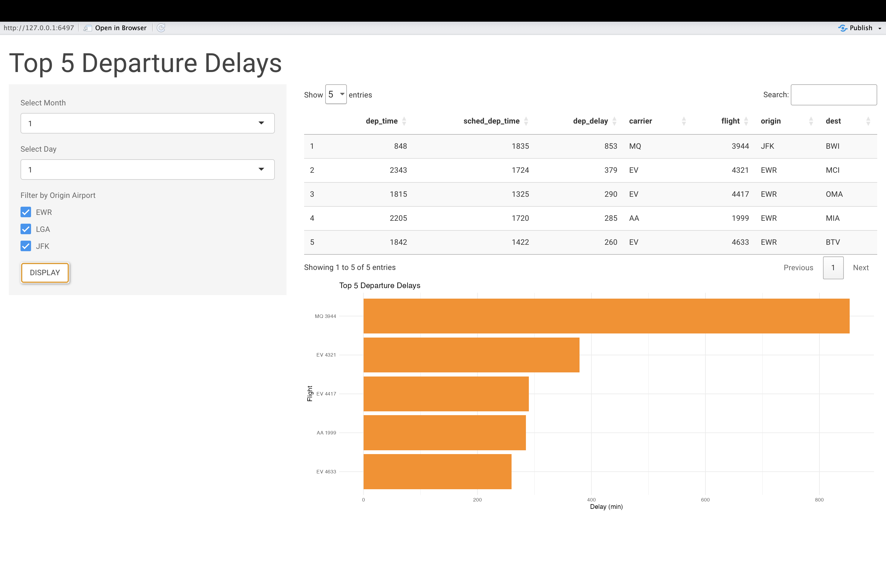

:::::::::::::::::::::::::::::::::::::: questions 

- How do you write a lesson using R Markdown and `{sandpaper}`?

::::::::::::::::::::::::::::::::::::::::::::::::

::::::::::::::::::::::::::::::::::::: objectives

- Explain how to use markdown with the new lesson template
- Demonstrate how to include pieces of code, figures, and nested challenge blocks

::::::::::::::::::::::::::::::::::::::::::::::::

## Preliminaries

Before beginning this episode, please ensure you have the following libraries installed and loaded:

```{r}
library(shiny)
library(shinyjs)
library(nycflights13)
library(tidyverse)
library(DT)
library(shinythemes)
```


## Introduction

Now that we are oriented to some of the fundamental principles of application development in Shiny, we'll use what we learned to develop simple applications that can facilitate interactive and intuitive data exploration. By showcasing how Shiny applications can function as interactive portals into static datasets, this Episode aims to stimulate ideas about how you might use Shiny to make your own datasets more broadly accessible to non-specialist audiences. 

This Episode uses a "case-study" approach to demonstrating how the basic principles we learned in the previous Episode can be applied in the context of developing dataset-based applications. Certain new features of Shiny will be introduced as we go, but for the most part, the focus will be on applying and reinforcing what we have already learned about Shiny, but in an applied context that is more relevant for researchers and data scientists than application developers. 

## Shiny template

Before proceeding to our first data application, we'll briefly introduce R Studio's Shiny template, which you can use to develop the applications in this Episode. In the previous Episode, we wrote out our simple Shiny applications in regular R scripts. Writing Shiny code from scratch offered good practice when starting out, but it's useful to know that R Studio comes with a prebuilt shiny template that can make it easier to develop applications. This template is actually a simple Shiny app, and we can swap out the elements in this template with our own as we go; this allows us to focus on our inputs and outputs, rather than the app's structure. To access this template go to **File**, then select **New File** followed by **Shiny Web App**:

```{r, echo=FALSE, fig:shiny-template, fig.cap="Figure 33. Accessing the Shiny Template"}
 
```

This will open up a small dialog box in which you're asked to name the application and specify a directory; R Studio will create a new sub-directory within the specified directory with the name you provide. This sub-directory can be used to house all of your application materials. R Studio automatically deposits a file within this sub-directory called **app.R**, which is the template. The template will also automatically be opened within R Studio after you close the dialog box. It looks something like this:

```{r, echo=FALSE, fig:shiny-template-file, fig.cap="Figure 34. The Shiny Template File"}
 
```

The template actually provides the script for a simple Shiny application, which you can launch by highlighting the script and clicking the **Run App** button in the menu bar right about the script. You can develop your own original applications by swapping in (and/or adding) your own title and application elements (inputs, outputs etc.) as you go. Using this template allows you to focus on these application elements, instead of worrying about writing the broader skeletal structure of the app from scratch. 

## Our first data application: querying flight delays

In your previous work learning about data analysis in R, you may have encountered a dataset of flight departures from New York City airports in 2013 from the *nycflights13* dataset:

```{r}
# prints flights dataset
nycflights13::flights
```

This dataset is intuitive, interesting, and possibly familiar from your previous education in R. It theerfore offers a good opportunity to develop our very first data based application. Imagine you are a transportation analyst who has been tasked with developing a simple application that allows end users to specify a month and date, and view a table containing information about the five flights with the longest departure delays on that day, along with a plot that allows them to visualize these delays. Such an application could be useful to a senior-level decisionmaker that may not necessarily have data science expertise, but needs to quickly query the dataset to get a sense of day-by-day delay patterns. It could also be useful on a public-facing website. 

Before starting to write your app (with the aid of the prebuilt Shiny template), it can be useful to consider briefly outline the app in plain language, which can subsequently help you to write out the code.

* The app will have a table and a plot as outputs, so we will need to reserve space in the UI for these elements using output placeholder functions. Recall from the previous episode that the placeholder function for plots is ```plotOutput()```. We didn't work with data tables in the previous episode, but Shiny's native data table output function is ```tableOutput()```. However, Shiny's native table functions are somewhat limited; they are static, when it is frequently the case that dynamic tables (which allow for scrolling) are preferable. The *DT* package has table functions that can be used in Shiny, and which support tables that have more functionality and which are aesthetically more appealing than native Shiny tables. As a result, we'll use these *DT* functions in our app. The relevant table output placeholder function from *DT* is ```dataTableOutput()```. 
* These placeholder functions will need to be accompanied by corresponding output render functions in the server; these render functions contain the code necessary to create the outputs that will populate the UI. Our plot will be created within the ```renderPlot()``` function, which we used in the previous episode. The *DT* package's render function, used in conjunction with ```dataTableOutput()``` is ```renderDataTable()```.
* We will use the ```selectInput()``` function in the UI to create a drop-down menu where users can select the day and month of interest.
* Turning to the server logic, it makes sense to create a reactive expression that extracts all of the records associated with the user's desired month and day, and feed this information into the render functions, where the records with the five highest delays can be subsetted using *dplyr*'s ```slice_head()``` function. In the ```renderPlot()``` function, this information will be used to make a plot (in *ggplot2*) of the five longest delays for that month/day. 

Now, let's translate this into Shiny code by populating the template with these functions and the relevant server logic:

```{r, eval=F}
ui <- fluidPage(
  titlePanel("Top 5 Departure Delays"),
  sidebarLayout(
    sidebarPanel(
      selectInput(inputId = "month", label = "Select Month", choices = 1:12, selected = 1),
      selectInput(inputId = "day", label = "Select Day", choices = 1:31, selected = 1)
    ),
    mainPanel(
      DT::dataTableOutput(outputId = "delay_table"),
      plotOutput(outputId = "delay_plot")
    )
  )
)

server <- function(input, output) {
  
  # reactive expression to extract records associated with the month/day desired by the user
  daily_flights <- reactive({
    flights %>%
      filter(month == input$month, day == input$day) %>%
      filter(!is.na(dep_delay))
  })
  
  # code to create table of the flights with the five longest delays on the user-specified day;
  # populates "dataTableOutput" in the UI
  output$delay_table <- DT::renderDataTable({
    daily_flights() %>%
      arrange(desc(dep_delay)) %>%
      slice_head(n = 5) %>%
      select(dep_time, sched_dep_time, dep_delay, carrier, flight, dest)
  }, options = list(pageLength = 5, scrollX = TRUE)) # specifies behavior and appearance of table
  
  # creates inverted bar plot of flights with the five longest delays on the user-specified day
  output$delay_plot <- renderPlot({
    top5 <- daily_flights() %>%
      arrange(desc(dep_delay)) %>%
      slice_head(n = 5)
    
    ggplot(top5, aes(x = reorder(paste(carrier, flight), dep_delay), y = dep_delay)) +
      geom_col(fill = "darkorange") +
      coord_flip() +
      labs(title = "Top 5 Departure Delays", x = "Flight", y = "Delay (min)") +
      theme_minimal()
  })
}

shinyApp(ui, server)

```

When you launch the app, it will look something like this:

```{r, echo=FALSE, fig:flight-delays, fig.cap="Figure 35. Flight Delay Application"}
 
```

Once it's launched, you should change the inputs and confirm that the outputs are responsive to these inputs. 

::::::::::::::::::::::::::::::::::::: challenge

## Challenge 1: Enhance the flight delay app

In this challenge, you will enhance the app we just created, both functionally and stylistically, using your knowledge of Shiny's features and tools. Please modify and/or add to the flight delay app's code in order to accomplish the following:

* Add a button labeled "Display" that users must press after specifying their desired input parameters in order for the app to update.
* Add an additional input filter (you can choose a widget of your choice) that allows users to filter observations by the originating airport (the "origin" field)
* Apply a theme of your choice from the *shinythemes* package to improve the appearance of the app. 

::: solution

The code below makes these changes. It uses the "paper" theme, check box filters to capture user preferences on the airport(s) of interest, and uses ```eventReactive()``` to activate updates when the button, created by ```actionButton()```, is clicked. 

```{r, eval=F}
ui <- fluidPage(
  theme = shinytheme("paper"),  # paper theme
  
  titlePanel("Top 5 Departure Delays"),
  
  sidebarLayout(
    sidebarPanel(
      selectInput("month", "Select Month", choices = 1:12, selected = 1),
      selectInput("day", "Select Day", choices = 1:31, selected = 1),
      # adds check box input to select airport; default is to have all options selected
      checkboxGroupInput("origin", "Filter by Origin Airport",
                         choices = unique(flights$origin),
                         selected = unique(flights$origin)),
      # adds "Display" button
      actionButton("go", "Display")  # Action button
    ),
    
    mainPanel(
      DT::dataTableOutput("delay_table"),
      plotOutput("delay_plot")
    )
  )
)

server <- function(input, output) {
  
  # Use eventReactive to delay updates until button is clicked; extract records associated with the   # month/day/airport desired by the user
  filtered_flights <- eventReactive(input$go, {
    flights %>%
      filter(month == input$month, day == input$day) %>%
      filter(origin %in% input$origin) %>%
      filter(!is.na(dep_delay))
  })
   # creates table of the flights with the five longest delays on the user-specified day and     
   # populates "dataTableOutput" in the UIairport(s);
  output$delay_table <- DT::renderDataTable({
    filtered_flights() %>%
      arrange(desc(dep_delay)) %>%
      slice_head(n = 5) %>%
      select(dep_time, sched_dep_time, dep_delay, carrier, flight, origin, dest)
  }, options = list(pageLength = 5, scrollX = TRUE)) # specifies behavior and appearance of table
  
   # creates inverted bar plot of flights with the five longest delays on the user-specified day and    # for specified airport(s)
  output$delay_plot <- renderPlot({
    top5 <- filtered_flights() %>%
      arrange(desc(dep_delay)) %>%
      slice_head(n = 5)
    
    ggplot(top5, aes(x = reorder(paste(carrier, flight), dep_delay), y = dep_delay)) +
      geom_col(fill = "darkorange") +
      coord_flip() +
      labs(title = "Top 5 Departure Delays", x = "Flight", y = "Delay (min)") +
      theme_minimal()
  })
}

shinyApp(ui, server)
```

When launched, the app will look something like this:

```{r, echo=FALSE, fig:flight-delays-exercise, fig.cap="Figure 36. Enhanced Flight Delay Application"}
 
```

:::

:::::::::::::::::::::::::::::::::::::


This is a lesson created via The Carpentries Workbench. It is written in
[Pandoc-flavored Markdown](https://pandoc.org/MANUAL.txt) for static files and
[R Markdown][r-markdown] for dynamic files that can render code into output. 
Please refer to the [Introduction to The Carpentries 
Workbench](https://carpentries.github.io/sandpaper-docs/) for full documentation.

What you need to know is that there are three sections required for a valid
Carpentries lesson template:

 1. `questions` are displayed at the beginning of the episode to prime the
    learner for the content.
 2. `objectives` are the learning objectives for an episode displayed with
    the questions.
 3. `keypoints` are displayed at the end of the episode to reinforce the
    objectives.

:::::::::::::::::::::::::::::::::::::::::::::::::::::::::::::::::::: instructor

Inline instructor notes can help inform instructors of timing challenges
associated with the lessons. They appear in the "Instructor View"

::::::::::::::::::::::::::::::::::::::::::::::::::::::::::::::::::::::::::::::::

::::::::::::::::::::::::::::::::::::: challenge 

## Challenge 1: Can you do it?

What is the output of this command?

```r
paste("This", "new", "lesson", "looks", "good")
```

:::::::::::::::::::::::: solution 

## Output
 
```output
[1] "This new lesson looks good"
```

:::::::::::::::::::::::::::::::::


## Challenge 2: how do you nest solutions within challenge blocks?

:::::::::::::::::::::::: solution 

You can add a line with at least three colons and a `solution` tag.

:::::::::::::::::::::::::::::::::
::::::::::::::::::::::::::::::::::::::::::::::::

## Figures

You can also include figures generated from R Markdown:

```{r pyramid, fig.alt = "pie chart illusion of a pyramid", fig.cap = "Sun arise each and every morning"}
pie(
  c(Sky = 78, "Sunny side of pyramid" = 17, "Shady side of pyramid" = 5), 
  init.angle = 315, 
  col = c("deepskyblue", "yellow", "yellow3"), 
  border = FALSE
)
```

Or you can use standard markdown for static figures with the following syntax:

`{alt='alt text for
accessibility purposes'}`

{alt='Blue Carpentries hex person logo with no text.'}

::::::::::::::::::::::::::::::::::::: callout

Callout sections can highlight information.

They are sometimes used to emphasise particularly important points
but are also used in some lessons to present "asides": 
content that is not central to the narrative of the lesson,
e.g. by providing the answer to a commonly-asked question.

::::::::::::::::::::::::::::::::::::::::::::::::


## Math

One of our episodes contains $\LaTeX$ equations when describing how to create
dynamic reports with {knitr}, so we now use mathjax to describe this:

`$\alpha = \dfrac{1}{(1 - \beta)^2}$` becomes: $\alpha = \dfrac{1}{(1 - \beta)^2}$

Cool, right?

::::::::::::::::::::::::::::::::::::: keypoints 

- Use `.md` files for episodes when you want static content
- Use `.Rmd` files for episodes when you need to generate output
- Run `sandpaper::check_lesson()` to identify any issues with your lesson
- Run `sandpaper::build_lesson()` to preview your lesson locally

::::::::::::::::::::::::::::::::::::::::::::::::

[r-markdown]: https://rmarkdown.rstudio.com/
