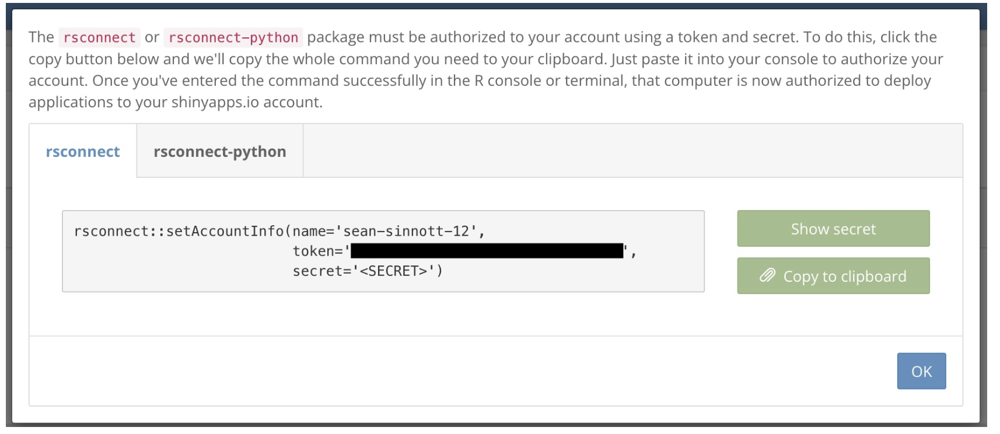

:::::::::::::::::::::::::::::::::::::: questions 

- What are some ways you can publish your Shiny web applications, and make them available to a wider audience? 

::::::::::::::::::::::::::::::::::::::::::::::::

::::::::::::::::::::::::::::::::::::: objectives

- Survey different options for publishing your Shiny web applications, and considerations associated with these options. 
- Deploy a web application to [shinyapps.io](https://www.shinyapps.io), an online platform hosted by Posit (the developers of R Studio). 

::::::::::::::::::::::::::::::::::::::::::::::::

## Preliminaries

Please load (or if necessary, install) the following package, which is necessary to deploy your applications to [shinyapps.io](https://docs.posit.co/shinyapps.io/guide/getting_started/). 

```{r}
library(rsconnect)
```

## Introduction

Now that you have some experience creating simple data applications and dashboard using Shiny, you may be wondering how these applications can be deployed online, so that those interested in your work can interact with your applications. After all, these applications have the potential to play an important role in the open source ecosystem, by allowing researchers to share their research data with non-specialist audiences in accessible ways. This final Episode will therefore suggest some ways to put your applications out into the world. 

## Publishing Shiny Applications: Surveying the Options

There are a variety of possible ways for you to disseminate your Shiny applications. Note that our assumption, in presenting these options, is that you would like to deploy your application(s) in your capacity as an individual. There are enterprise-level deployment solutions, such as [Posit Connect](https://posit.co/products/enterprise/connect/) and the open-source [Shiny Server](https://posit.co/products/open-source/shiny-server/),that are beyond our scope, but which may be useful, depending on your particular professional or organizational context. Also, please note that the options below are not exhaustive, even when limiting our concern to individual-level deployment options; if none of these options meet your needs, you may want to do some research and investigate possible alternatives that do. That said, the possibilities below are good potential starting points. 

**Posit**, which is the developer of R Studio, offers the most user-friendly and intuitive way to publish your Shiny Apps in the form of [shinyapps.io](https://www.shinyapps.io)). We will discuss this platform and hosting service at greater length below. If you do not want to use Posit's service, you might consider a containerized deployment, in which you package your app and environment in a Docker container and deploy it to a cloud hosting service such as AWS, Google Cloud, or Azure; of course, this requires meaningful technical expertise, and would be a considerably more complex process than deploying to *shinyapps.io*. However, these alternative cloud deployments are likely to give you greater flexibility and control in managing the deployment of your app. 

It is also possible to share your applications in static (non-interactive ways), and leave it to your users to launch your application locally, based on the application code. Github repositories can be an excellent place to store your application code and related materials, where they can be accessed by others. Of course, this requires some expertise on the part of the end-users (i.e. knowing how to clone a Github repository and launch a Shiny application locally), and sharing your applications this way may not allow you to realize the goal of making your dataset(s) accessible to broad non-specialist audiences, including the broader public. Of course, the choice between sharing your applications in non-interactive formats (i.e. via an application code repository on Github) or deploying to the web, is not necessarily either/or. Indeed, it makes a lot of sense to deploy your application to the web using a service such as *shinyapps.io*, but also maintain a Github repository for your code, which can facilitate code sharing, teaching, and research reproducibility. Hosting your application code on Github can also be a way to [assign a DOI](https://docs.github.com/en/repositories/archiving-a-github-repository/referencing-and-citing-content) to your application and dashboard projects (via Github's integration with Zenodo), which facilitates discoverability and long-term preservation. 

## Deploying to shinyapps.io

In this section, we'll go into a bit more detail on deploying your Shiny applications on Posit's [shinyapps.io](https://www.shinyapps.io)) service, since that offers the easiest way for you to publish your applications online, where they can be accessed by anyone with an internet connection. 

### Setting up and configuring your *shinyapps* account and *rsconnect*

In order to set up and configure *rsconnect*, which is needed to deploy your Shiny apps to *shinyapps.io*, please take the following steps:

1. Got to[shinyapps.io](https://www.shinyapps.io)), and if you haven't already, create an account and log in. 
2. Install and load the *rsconnect* package in your local instance of R Studio (as you would any other package)
3. Once you are within your *shinyapps.io* account, click your user name in the top right of the page, and select the **Tokens** button. 
4. On the *Tokens* page, you will see a window that looks something like this:


```{r, echo=FALSE, fig:shinyapps.uo, fig.cap="Figure 40. Authorizing rsconnect (source: Posit documentation)"}
 
```

Copy that command, paste it into your R console, and run it. 
5. At this point, you have *rsconnect* configured, and can use it to deploy Shiny apps saved locally to *shinyapps.io*. 

### Deploying your Shiny applications

In order to deploy your applications, follow these steps:

1. Make sure your Shiny application code, and related materials, are stored in a dedicated directory. The **.R** file containing your code *must* be saved as **app.R**. 
2. Identify the file path to the directory with your application code and related materials (such as the data needed to run your application)
3. Pass the file path as an argument to *rsconnect's* ```deployApp()``` function, i.e. ```rsconnect::deployApp(<file path>```. This will deploy your application to *shinyapps.io*, where you can find the url to your application and visit your application online. Anybody with an internet connection and this url can access your Shiny app, and interact with it in the way you designed. 

Within your *shinyapps.io* account, which is itself laid out as a dashboard, you can see a list of your deployed dashboards by clicking the **Applications** tab on the left. Within that page, clicking on the link to your deployed application will take you to an application-specific page (known as "Application View"), which contains the application url, and usage statistics. From this page, you can also [archive](https://docs.posit.co/shinyapps.io/guide/applications/index.html#archiving-your-application) or [delete](https://docs.posit.co/shinyapps.io/guide/applications/index.html#archiving-your-application) your applications. 

Note that if you are on the free tier, you can deploy up to five applications at a time, but other usage limits apply. To see more information about pricing and usage, please go to the [shinyapps.io](https://www.shinyapps.io) page and scroll down. In general, the free tier is sufficient for most research-related use cases (especially if you carefully manage deployments), but in some cases it may be worthwhile to pay for increased deployment and usage limits, as well as increased security

Much of this information rehashes the [shinyapps.io documentation and user guide](https://docs.posit.co/shinyapps.io/guide/index.html), which is a good place to go if you have further questions or need additional guidance. 

::::::::::::::::::::::::::::::::::::: challenge 

## Deploy an application to shinyapps.io

Take an application or dashboard that you created in one of the previous episodes, and publish it to [shinyapps.io](https://www.shinyapps.io). Copy the link to your application, share it with a partner, and have them confirm your application is working. 

:::::::::::::::::::::::::::::::::


::::::::::::::::::::::::::::::::::::: keypoints 

- There are a variety of ways to publish your Shiny applications and dashboards to the web, depending on your needs
- The most intuitive and beginner-friendly publication platform is Posit's [shinyapps.io](https://shinyapps.io)
- Before being able to deploy your apps to *shinyapps.io*, you must set up an account, and configure *rsconnect*
- After this initial set up, you can deploy your application by passing the filepath to the application directory (which contains the **app.R** file containing your application code, as well as any other relevant dependencies) as an argument to *rsconnect's* ```deployApp()``` function. 
- Once the application is deployed, you can go to your *shinyapps.io* account page (and particularly the page's "Application View") to retrieve the published application's url, track usage statistics, and manage your application (for example, archive or delete it when you no longer want it publicly available). 

::::::::::::::::::::::::::::::::::::::::::::::::

