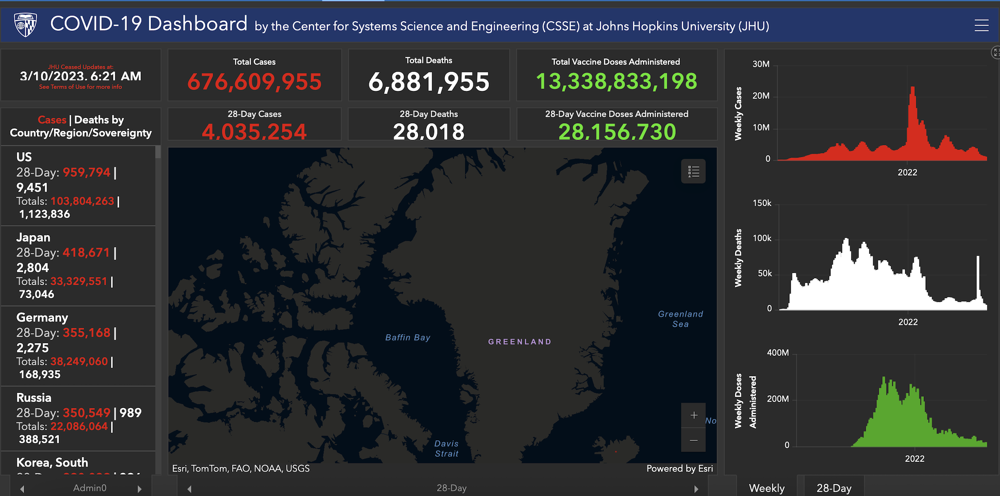

:::::::::::::::::::::::::::::::::::::: questions 

- Why might you want to create an interactive data application or dashboard as a wrapper for your research data?
- What is the *Shiny* package in R?
- What are some examples of data applications or dashboards created with the Shiny package ecosystem? 

::::::::::::::::::::::::::::::::::::::::::::::::

::::::::::::::::::::::::::::::::::::: objectives

- Survey published examples of Shiny applications and dashboards and explore some of their features and properties
- Reflect on what an "ideal" application or dashboard would look like for your particular research data use case
- Appreciate the relevance of data applications and dashboards for Open Science

::::::::::::::::::::::::::::::::::::::::::::::::

## Interactive Data Applications for Open Science

The practice of open science promotes a global “knowledge commons” that has the potential to support enlightened and informed public discourse. While open scholarly outputs such as open-access publications and research datasets are typically intended for scholarly audiences with specialized training and expertise, the broader public is a critical stakeholder in open science, and researchers may wish to invite non-specialist audiences to engage with their research data and findings for a variety of reasons, such as the following: 

* Some researchers may view it as a civic duty, to the extent that a significant share of scientific research is ultimately funded by the public
* It offers academic researchers an opportunity to build their public profiles beyond their scholarly communities, which allows them to credibly share their expertise 
* It could help to build public appreciation for open science and academic research, which could have valuable downstream impacts (i.e. increased funding)
* The research data may cast important light on issues of public interest or public policy, and making it available to a broad non-specialist audience in an accessible form could contribute to a more informed or enlightened public discourse

In short, the dissemination of research data to non-specialist audiences can be an important and valuable part of scientific communication in the context of open science. However, it can be challenging to present complex research datasets in ways that are intuitive, accessible, and engaging to a broader audience. One way to do so is through the use of digital applications that wrap research datasets into an interactive graphical-user-interface (GUI) that allows non-specialists to explore and query the underlying data. These applications can be constructed in any number of ways. Data dashboards are one example of a GUI-based data exploration application; typically, a dashboard offers an interactive visual display of multiple pieces of information in different formats, arrayed across different sections or "panels" of a rectangular display. One famous example of a data dashboard is the [COVID-19 Dashboard](https://coronavirus.jhu.edu/map.html), developed by the Center for Systems Science and Engineering at Johns Hopkins:

```{r, fig:covid-example, fig.cap="Figure 1. The Johns Hopkins COVID-19 Dashboard", echo=FALSE}

```

Data dashboards, and interactive data applications more generally, are frequently used in government, public health, and corporate contexts in which important and potentially complex information needs to be communicated with a broad audience in an accessible way. However, they are not used as frequently in the context of communicating information and insights derived from research data. There could be many potential reasons for this, one of which is that the creation of these applications can be time-consuming and resource-intensive for researchers and scientists who do not have previous experience with application development. For such researchers, who would like to develop simple applications that could help foster broader engagement with their research and data, but do not have software expertise or access to specialized programs that facilitate application or dashboard creation, the *Shiny* package ecosystem is an excellent option. 

## The *Shiny* Package Ecosystem for Interactive Application Development

The *Shiny* package facilitates the development of interactive data-oriented applications (such as data exploration tools, dashboards, and user interfaces for data) in programming languages familiar to empirical researchers and data scientists, such as R and Python, without requiring any knowledge of traditional application development tools HTML, CSS, JavaScript. Because Shiny applications are written using R or Python, they are also able to leverage the powerful data manipulation, visualization, and analysis capabilities of these scientific computing languages, while wrapping them into a responsive and intuitive interface that allows researchers to communicate insights and share their data in an engaging and accessible manner. Shiny apps can be deployed locally or hosted online, and allow you to create a useful bridge between data analysis and statistical computing work (which other Carpentries lessons introduce) and non-specialist downstream "consumers" of your research. 

There are several adjacent packages that add to the core *Shiny* package's functionality, and allow for the creation of more sophisticated applications. Examples of packages within this broader Shiny ecosystem include (but are not limited to):

* *shinydashboard* offers functions that simplify the process of dashboard creation
* *shinyWidgets* offers functions that allow one to enrich and customize the user interface of Shiny applications
* *shinythemes* provides tools to customize the appearance of Shiny applications
* *rsconnect* allows for the deployment of Shiny applications to sites such as [shinyapps.io](https://www.shinyapps.io) or [Posit Connect](https://posit.co/products/enterprise/connect/).

Over the course of the Workshop, we will work with a variety of packages within the broader *Shiny* ecosystem. 

## Exploring Shiny Applications

Before proceeding to the next Episode, and getting started with the process of building *Shiny* applications for your data, it can be useful to survey some published applications created with Shiny. 


::::::::::::::::::::::::::::::::::::: challenge 

## Challenge 1: Explore Shiny Applications

Go to this [online repository of published Shiny applications](https://shiny.posit.co/r/gallery/#user-showcase) and look around. Are there any applications you find especially appealing? What are some of its relevant features and characteristics? After getting acquainted with some "real world" Shiny applications, sketch out a rough prototype for a Shiny application that could be relevant for your own work. 

:::::::::::::::::::::::: solution 

Discuss your observations and protoypes with a partner. 

:::::::::::::::::::::::::::::::::
::::::::::::::::::::::::::::::::::::::::::::::::

::::::::::::::::::::::::::::::::::::: keypoints 

- Interactive applications and dashboards are valuable tools for presenting complex research data in an intuitive and engaging way, particularly for non-specialist audiences.
- Open science benefits from such applications because they can help increase public understanding, enhance the visibility of research, and support informed discourse on topics of public interest.
- Shiny is an R package that allows researchers to create interactive web applications and dashboards without needing to know web technologies like HTML, CSS, or JavaScript.

::::::::::::::::::::::::::::::::::::::::::::::::

[r-markdown]: https://rmarkdown.rstudio.com/
